# ACL Graph 特性

## 1. 特性概述

- **特性介绍**：ACL Graph（流捕获）特性支持将单个 Stream 上的任务序列捕获为可复用的 CaptureModel，实现任务序列的优化执行和资源复用。捕获后的图可多次执行，减少调度开销。
- **问题背景**：单算子执行模式下，每次算子执行都需要单独提交任务，存在调度开销。通过捕获算子序列构建优化图，可减少调度开销并实现算子序列复用。
- **设计目标**：
  - 支持流捕获机制（BeginCapture/EndCapture）
  - 支持多捕获模式（GLOBAL/THREAD_LOCAL/RELAXED）
  - 支持级联捕获和扩流机制
  - 支持软件 SQ 动态绑定
  - 支持 TaskGroup 任务组管理
  - 支持图更新和多次执行
  - 支持条件控制流（Cond 场景：IF/WHILE/SWITCH），通过 CondHandle 管理条件值，实现动态分支执行

## 2. 使用场景与对外接口

### 2.1 使用场景

- **场景一**：单算子流捕获
  ```cpp
  // 开始捕获
  aclError ret = aclmdlRICaptureBegin(stream, ACL_MODEL_RI_CAPTURE_MODE_GLOBAL);
  
  // 执行算子序列（任务被记录而非立即执行）
  aclrtKernelLaunch(stream, kernel1, ...);
  aclrtKernelLaunch(stream, kernel2, ...);
  
  // 结束捕获，获得 CaptureModel
  aclmdlRI captureModel;
  ret = aclmdlRICaptureEnd(stream, &captureModel);
  
  // 多次执行捕获的图
  ret = aclmdlRIExecute(captureModel, exeStream, -1);
  ```

- **场景二**：多流捕获（级联捕获）
  ```cpp
  // 在原始流上开始捕获
  aclmdlRICaptureBegin(stream1, ACL_MODEL_RI_CAPTURE_MODE_GLOBAL);
  
  // 当 SQ 深度不足时，自动创建级联流继续捕获
  // 或主动添加其他流到捕获模型
  rtStreamAddToModel(stream2, captureModel);
  
  // 结束捕获
  aclmdlRICaptureEnd(stream1, &captureModel);
  ```

- **场景三**：TaskGroup 任务组
  ```cpp
  // 开始任务组
  aclmdlRICaptureTaskGrpBegin(stream);
  
  // 执行一系列任务
  aclrtKernelLaunch(stream, kernel1, ...);
  aclrtKernelLaunch(stream, kernel2, ...);
  
  // 结束任务组，获得 TaskGroup handle
  TaskGroup *handle;
  aclmdlRICaptureTaskGrpEnd(stream, &handle);
  
  // 后续可更新任务组中的任务
  aclmdlRICaptureTaskUpdateBegin(stream, handle);
  aclmdlRICaptureTaskUpdateEnd(stream);
  ```

- **场景四**：模型更新
  ```cpp
  // 检查模型是否支持更新
  aclError ret = aclmdlRICheckCaptureForUpdate(stream);
  
  // 更新模型
  ret = aclmdlRIUpdate(captureModel);
  ```

- **场景五**：条件控制流（Cond 场景）
  ```cpp
  // 1. 开始父模型捕获
  aclmdlRICaptureBegin(stream1, ACL_MODEL_RI_CAPTURE_MODE_GLOBAL);
  
  // 2. 获取父模型（通过 aclmdlRICaptureGetInfo 或在 EndCapture 时获取）
  aclmdlRI parentModel;
  aclmdlRICaptureStatus status;
  aclmdlRICaptureGetInfo(stream1, &status, &parentModel);
  
  // 3. 在父模型捕获期间创建 CondHandle（要求父模型处于 CAPTURE_ACTIVE 状态）
  aclmdlRICondHandle condHandle;
  aclmdlRICondHandleCreate(parentModel, 0U, ACL_MODEL_RI_COND_HANDLE_ASSIGN_DEFAULT, &condHandle);
  
  // 4. 获取条件值 device 指针，用户可自定义算子修改条件值
  uint64_t *condDevPtr = nullptr;
  aclmdlRICondHandleGetCondPtr(condHandle, &condDevPtr);
  
  // 5. 下发条件任务，创建子模型（要求流处于捕获状态）
  aclmdlRI subModels[2];
  aclmdlRICondTaskParams params = {};
  params.handle = condHandle;
  params.type = ACL_MODEL_RI_COND_TYPE_IF;
  params.size = 2; // IF 分支数
  params.modelRIArray = subModels;
  aclmdlRIAddCondTask(params, stream1, 0U);
  
  // 6. 对每个子模型进行捕获（使用单独的流，子模型通过 aclmdlRICaptureToModelRIBegin 绑定）
  aclmdlRICaptureToModelRIBegin(stream2, subModels[0], ACL_MODEL_RI_CAPTURE_MODE_GLOBAL);
  aclrtKernelLaunch(stream2, kernel1, ...);
  aclmdlRICaptureEnd(stream2, nullptr); // 子模型 0 结束捕获
  
  aclmdlRICaptureToModelRIBegin(stream3, subModels[1], ACL_MODEL_RI_CAPTURE_MODE_GLOBAL);
  aclrtKernelLaunch(stream3, kernel2, ...);
  aclmdlRICaptureEnd(stream3, nullptr); // 子模型 1 结束捕获
  
  // 7. 结束父模型捕获（所有子模型必须已 EndCapture，否则返回错误）
  aclmdlRICaptureEnd(stream1, &parentModel);
  
  // 8. 执行父模型，条件值决定执行哪个子模型分支
  aclmdlRIExecute(parentModel, exeStream, -1);
  ```

### 2.2 对外接口

| 接口 | 文件位置 | 说明                       |
|------|----------|----------------------------|
| `aclmdlRICaptureBegin()` | `src/acl/aclrt_impl/model_ri.cpp` | 开始流捕获                 |
| `aclmdlRICaptureEnd()` | `src/acl/aclrt_impl/model_ri.cpp` | 结束流捕获                 |
| `aclmdlRICaptureGetInfo()` | `src/acl/aclrt_impl/model_ri.cpp` | 获取捕获状态信息           |
| `rtStreamAddToModel()` | `context_aclgraph.cc:554` | 添加流到捕获模型 |
| `aclmdlRICaptureTaskGrpBegin()` | `src/acl/aclrt_impl/model_ri.cpp` | 开始任务组                 |
| `aclmdlRICaptureTaskGrpEnd()` | `src/acl/aclrt_impl/model_ri.cpp` | 结束任务组                 |
| `aclmdlRICaptureTaskUpdateBegin()` | `src/acl/aclrt_impl/model_ri.cpp` | 开始任务更新               |
| `aclmdlRICaptureTaskUpdateEnd()` | `src/acl/aclrt_impl/model_ri.cpp` | 结束任务更新               |
| `aclmdlRIExecute()` | `src/acl/aclrt_impl/model_ri.cpp` | 执行捕获模型               |
| `aclmdlRIExecuteAsync()` | `src/acl/aclrt_impl/model_ri.cpp` | 异步执行捕获模型           |
| `aclmdlRIUpdate()` | `src/acl/aclrt_impl/model_ri.cpp` | 更新捕获模型               |
| `aclmdlRICaptureThreadExchangeMode()` | `src/acl/aclrt_impl/model_ri.cpp` | 交换线程捕获模式           |
| `aclmdlRICondHandleCreate()` | `src/acl/aclrt_impl/model_ri.cpp` | 创建条件句柄               |
| `aclmdlRICondHandleGetCondPtr()` | `src/acl/aclrt_impl/model_ri.cpp` | 获取条件值 device 指针     |
| `aclmdlRIAddCondTask()` | `src/acl/aclrt_impl/model_ri.cpp` | 下发条件任务，创建子模型   |
| `aclmdlRICaptureToModelRIBegin()` | `src/acl/aclrt_impl/model_ri.cpp` | 子模型开始捕获 |

### 2.3 捕获模式定义

```cpp
// 捕获模式：控制多线程捕获行为
typedef enum {
    ACL_MODEL_RI_CAPTURE_MODE_GLOBAL = 0,      // 全局模式：所有线程共享捕获状态
    ACL_MODEL_RI_CAPTURE_MODE_THREAD_LOCAL, // 线程本地模式：仅当前线程可操作
    ACL_MODEL_RI_CAPTURE_MODE_RELAXED,      // 松弛模式：允许其他线程操作
} aclmdlRICaptureMode;
```

### 2.4 捕获状态定义

```cpp
// 流捕获状态
typedef enum {
    ACL_MODEL_RI_CAPTURE_STATUS_NONE = 0,       // 未捕获
    ACL_MODEL_RI_CAPTURE_STATUS_ACTIVE,     // 正在捕获
    ACL_MODEL_RI_CAPTURE_STATUS_INVALIDATED, // 捕获已失效
} aclmdlRICaptureStatus;

// 模型捕获状态
enum class RtCaptureModelStatus {
    NONE = 0,            // 初始状态
    CAPTURE_ACTIVE,      // 正在捕获
    CAPTURE_INVALIDATED, // 捕获失效
    UPDATING,            // 正在更新
    FAULT,               // 故障状态
    READY,               // 就绪状态（可执行）
};
```

### 2.5 条件控制流数据类型定义

```cpp
// 条件句柄
typedef void *aclmdlRICondHandle;

// 条件句柄标志
typedef enum {
    ACL_MODEL_RI_COND_HANDLE_ASSIGN_DEFAULT = 1, // 模型执行时，条件值初始化为 defaultValue
} aclmdlRICondHandleFlag;

// 条件任务类型
typedef enum {
    ACL_MODEL_RI_COND_TYPE_IF = 0,      // IF 条件：size 为 1 或 2
    ACL_MODEL_RI_COND_TYPE_WHILE = 1,   // WHILE 条件：size 为 1
    ACL_MODEL_RI_COND_TYPE_SWITCH = 2,  // SWITCH 条件：size > 0
} aclmdlRICondTaskType;

// 条件任务参数
typedef struct aclmdlRICondTaskParams {
    aclmdlRICondHandle handle;     // 条件句柄
    aclmdlRICondTaskType type;     // 条件类型
    uint32_t size;             // 分支个数
    aclmdlRI *modelRIArray;   // 子模型数组
} aclmdlRICondTaskParams;
```

## 3. 架构总览

### 整体设计思路

ACL Graph 通过 **CaptureModel** 管理捕获的图结构，**Stream** 维护捕获状态（captureStatus），捕获过程中通过 **级联流** 和 **TaskGroup** 管理任务序列。执行时通过 **Software SQ** 动态绑定实现高效调度。

### 架构分层图

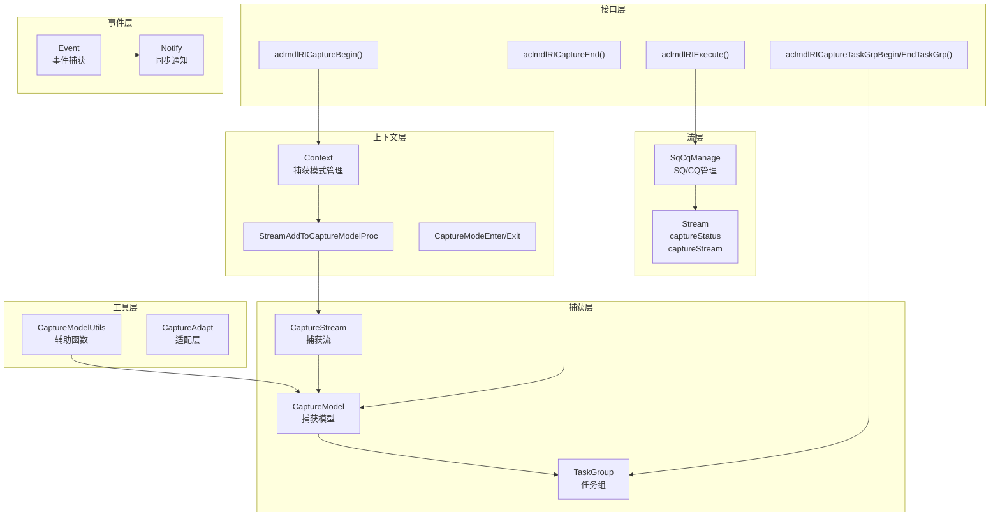

### 核心模块交互图

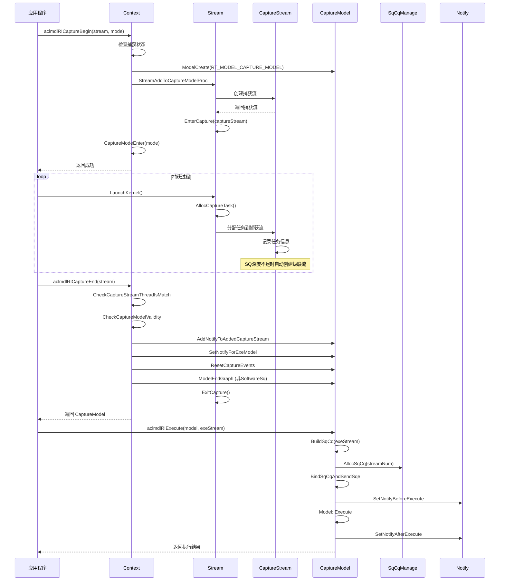

### 条件控制流交互图

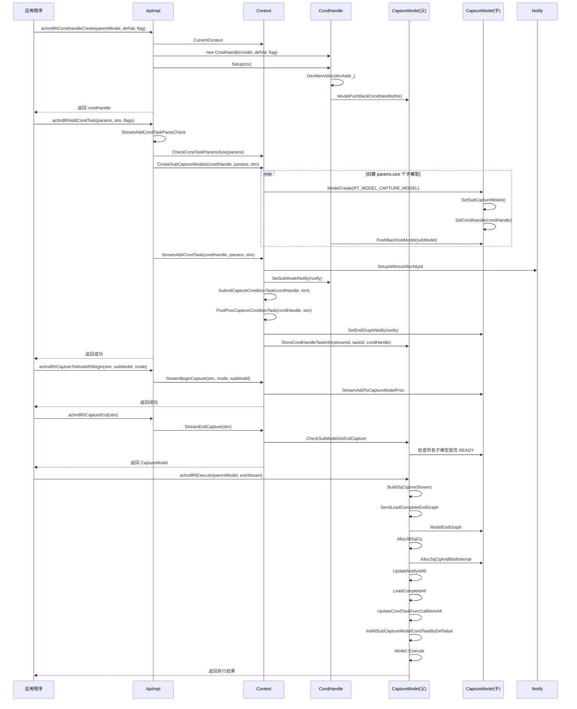

## 4. 详细设计

### 4.1 核心流程

#### 流捕获开始流程

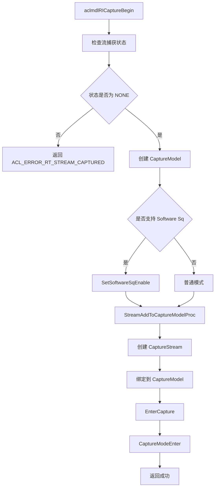

**关键代码**：

```cpp
// 文件位置：src/runtime/feature/aclgraph/context_aclgraph.cc:259-323
rtError_t Context::StreamBeginCapture(Stream * const stm, const rtStreamCaptureMode mode, Model * const mdl)
{
    Model *captureModel = mdl;
    // ...
    const rtStreamCaptureStatus status = stm->GetCaptureStatus();
    const int32_t streamId = stm->Id_();

    // 检查捕获状态
    if (status != RT_STREAM_CAPTURE_STATUS_NONE) {
        return RT_ERROR_STREAM_CAPTURED;
    }

    // 创建 CaptureModel（mdl 为 nullptr 时创建新模型，否则使用传入的子模型）
    if (captureModel == nullptr) {
        error = ModelCreate(&captureModel, RT_MODEL_CAPTURE_MODEL);
        // ...
    }

    // 检查是否支持 Software Sq
    if ((stm->Device_()->IsSupportFeature(RtOptionalFeatureType::RT_FEATURE_MODEL_ACL_GRAPH_SOFTWARE_ENABLE)) && 
        (stm->Device_()->CheckFeatureSupport(TS_FEATURE_SOFTWARE_SQ_ENABLE)) &&
        (NpuDriver::CheckIsSupportFeature(device_->Id_(), FEATURE_TRSDRV_SQ_SUPPORT_DYNAMIC_BIND))) {
        CaptureModel *captureModelTmp = dynamic_cast<CaptureModel *>(captureModel);
        captureModelTmp->SetSoftwareSqEnable();
    }

    std::unique_lock<std::mutex> taskLock(captureLock_);
    error = StreamAddToCaptureModelProc(stm, captureModel, true);
    // ...
    CaptureModeEnter(stm, mode);
    return RT_ERROR_NONE;
}
```

#### 任务捕获分配流程

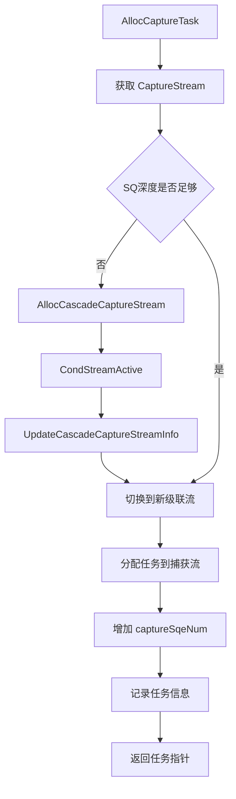

**关键代码**：

```cpp
// 文件位置：src/runtime/feature/aclgraph/stream_capture.cc:76-131
rtError_t Stream::AllocCaptureTaskWithoutLock(tsTaskType_t taskType, uint32_t sqeNum, TaskInfo **task)
{
    Stream *curCaptureStream = GetCaptureStream();
    if (curCaptureStream == nullptr) {
        return RT_ERROR_STREAM_CAPTURE_EXIT;
    }

    // 检查 SQ 深度是否足够
    if ((curCaptureStream->GetCaptureSqeNum() + CAPTURE_TASK_RESERVED_NUM +
         device_->GetDevProperties().expandStreamRsvTaskNum) >=
         curCaptureStream->GetSqDepth()) {
        // SQ 深度不足，创建级联流
        Stream *newCaptureStream = nullptr;
        Context * const ctx = Context_();
        rtError_t error = AllocCascadeCaptureStream(newCaptureStream, curCaptureStream);
        // ...
        error = CondStreamActive(newCaptureStream, curCaptureStream);
        // ...
        UpdateCascadeCaptureStreamInfo(newCaptureStream, curCaptureStream);
        curCaptureStream = newCaptureStream;
    }

    // 分配任务
    rtError_t errCode = RT_ERROR_TASK_NEW;
    if (curCaptureStream->taskResMang_ == nullptr) {
        *task = device_->GetTaskFactory()->Alloc(curCaptureStream, taskType, errCode);
    }
    if (*task != nullptr) {
        curCaptureStream->AddCaptureSqeNum(sqeNum);
        (*task)->stream = curCaptureStream;
        Runtime::Instance()->AllocTaskSn((*task)->taskSn);
        // ...
    }
    return RT_ERROR_NONE;
}
```

#### 条件句柄创建流程

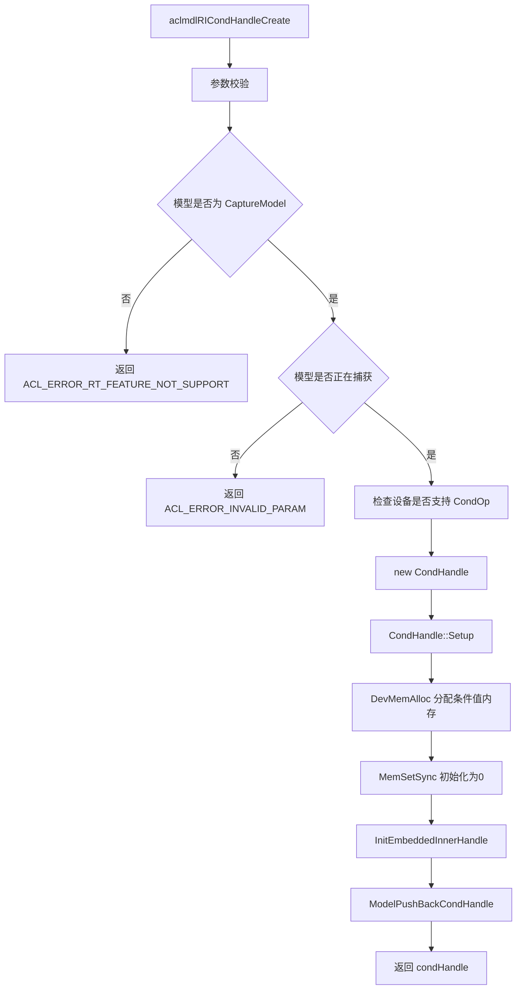

**关键代码**：

```cpp
// 文件位置：src/runtime/feature/aclgraph/v100/api_impl_aclgraph.cc:178-203
rtError_t ApiImpl::ModelCondHandleCreate(Model * const mdl, uint32_t defaultValue,
    rtCondHandleFlag_t flag, CondHandle ** const handle)
{
    CaptureModel *captureModel = dynamic_cast<CaptureModel *>(mdl);
    NULL_PTR_RETURN_MSG_OUTER(captureModel, RT_ERROR_INVALID_VALUE);
    COND_RETURN_AND_MSG_OUTER(!(captureModel->IsCaptureActive()),
        RT_ERROR_INVALID_VALUE, ErrorCode::EE1017, __func__, "mdl",
        "The ACL Graph has finished capturing.");
    Context * const curCtx = CurrentContext();
    CHECK_CONTEXT_VALID_WITH_RETURN(curCtx, RT_ERROR_CONTEXT_NULL);
    rtError_t error = CheckCaptureModelSupportCondOp(curCtx->Device_());
    COND_RETURN_WITH_NOLOG(error != RT_ERROR_NONE, error);

    CondHandle *condHandle = new (std::nothrow) CondHandle(mdl, defaultValue, flag);
    COND_RETURN_AND_MSG_OUTER((condHandle == nullptr), RT_ERROR_MEMORY_ALLOCATION, ...);

    error = condHandle->Setup(curCtx);
    if (error != RT_ERROR_NONE) {
        DELETE_O(condHandle);
        return error;
    }

    *handle = condHandle;
    return RT_ERROR_NONE;
}
```

#### 条件任务下发流程

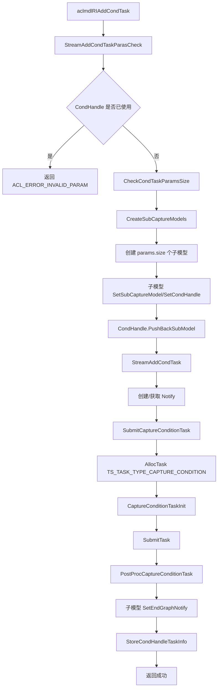

**关键代码**：

```cpp
// 文件位置：src/runtime/feature/aclgraph/context_aclgraph.cc:849-872
rtError_t Context::CreateSubCaptureModels(CondHandle *condHandle, rtCondTaskParams params, Stream * const stm)
{
    for (uint32_t loop = 0; loop < params.size; loop++) {
        Model *subModel = nullptr;
        const rtError_t ret = ModelCreate(&subModel, RT_MODEL_CAPTURE_MODEL);
        // ...
        models_.remove(subModel); // 子模型资源回收不遍历，靠父模型递归完成
        subModel->SetExeStream(stm->GetCaptureStream()); // 子模型执行流固定
        CaptureModel *subCaptureModel = dynamic_cast<CaptureModel *>(subModel);
        subCaptureModel->SetSubCaptureModel();
        subCaptureModel->SetCondHandle(params.handle);
        condHandle->PushBackSubModel(subModel);
        params.modelRIArray[loop] = static_cast<rtModel_t>(subModel);
    }
    return RT_ERROR_NONE;
}
```

#### 子模型捕获流程

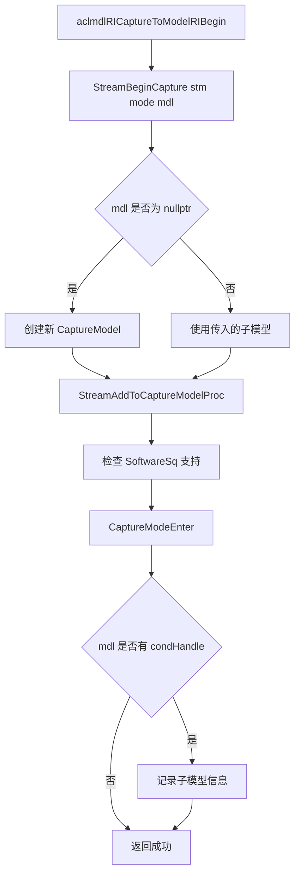

**关键代码**：

```cpp
// 文件位置：src/runtime/feature/aclgraph/context_aclgraph.cc:259-323
rtError_t Context::StreamBeginCapture(Stream * const stm, const rtStreamCaptureMode mode, Model * const mdl)
{
    Model *captureModel = mdl;
    // ...
    if (captureModel == nullptr) {
        error = ModelCreate(&captureModel, RT_MODEL_CAPTURE_MODEL);
        // ...
    }
    // ...
    error = StreamAddToCaptureModelProc(stm, captureModel, true);
    // ...
    CaptureModeEnter(stm, mode);

    CondHandle *condHandle = nullptr;
    CaptureModel *captureMdl = dynamic_cast<CaptureModel *>(captureModel);
    const rtError_t ret = GetValidatedObject<CondHandle>(captureMdl->GetCondHandle(), condHandle);
    COND_PROC(ret != RT_ERROR_NONE, return RT_ERROR_NONE;);
    // 父model取到的condHandle是nullptr，接口不返错
    // ...
    return RT_ERROR_NONE;
}
```


#### 流捕获结束流程

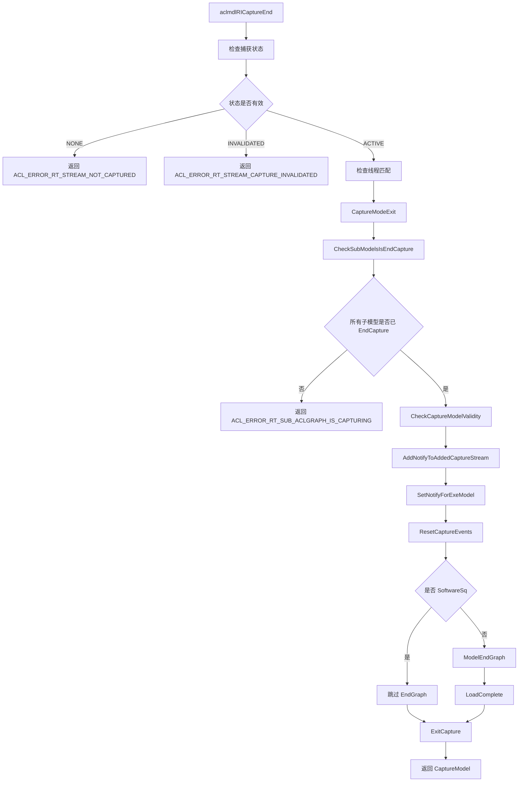

**关键代码**：

```cpp
// 文件位置：src/runtime/feature/aclgraph/context_aclgraph.cc:471-590
rtError_t Context::StreamEndCapture(Stream * const stm, Model ** const captureMdl)
{
    std::unique_lock<std::mutex> taskLock(captureLock_);
    const rtStreamCaptureStatus status = stm->GetCaptureStatus();
    
    // 检查捕获状态
    if (status == RT_STREAM_CAPTURE_STATUS_NONE) {
        return RT_ERROR_STREAM_NOT_CAPTURED;
    }

    Stream *captureStream = stm->GetCaptureStream();
    if (!(captureStream->IsOrigCaptureStream())) {
        return RT_ERROR_STREAM_CAPTURE_UNMATCHED;
    }

    rtError_t error = CheckCaptureStreamThreadIsMatch(stm);
    // ...
    CaptureModeExit(stm);

    Model *captureModel = captureStream->Model_();
    CaptureModel *captureModelTmp = RtPtrToPtr<CaptureModel *, Model *>(captureModel);
    
    // 检查所有子模型是否已 EndCapture（Cond 场景）
    const bool isCaptureFinished = CheckSubModelsIsEndCapture(captureStream);
    COND_PROC_RETURN_ERROR(!isCaptureFinished, RT_ERROR_STREAM_SUB_ACLGRAPH_IS_CAPTURING, ...);

    // 检查模型有效性
    error = CheckCaptureModelValidity(captureModel);
    // ...

    // 设置 Notify
    error = AddNotifyToAddedCaptureStream(stm, static_cast<CaptureModel *>(captureModelTmp));
    error = SetNotifyForExeModel(captureModelTmp);
    error = captureModelTmp->ResetCaptureEvents(stm);

    // 非 SoftwareSq 模式需要 EndGraph
    if (!captureModelTmp->IsSoftwareSqEnable()) {
        Api * const apiObj = Runtime::Instance()->ApiImpl_();
        error = apiObj->ModelEndGraph(captureModel, captureStream, 0U);
        error = captureModel->LoadComplete();
    }

    stm->ExitCapture();
    *captureMdl = captureModel;
    return RT_ERROR_NONE;
}
```

#### 模型执行流程

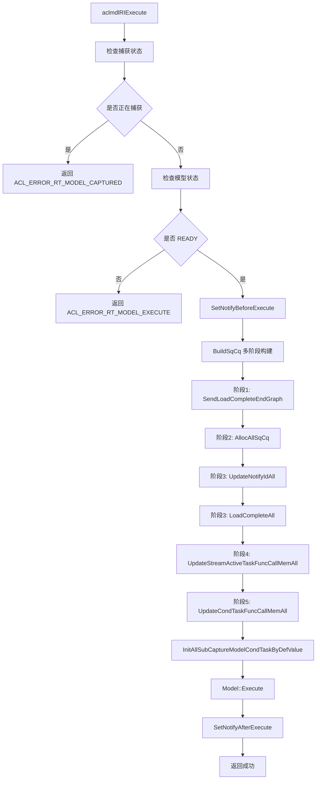

**关键代码**：

```cpp
// 文件位置：src/runtime/feature/aclgraph/capture_model.cc:198-243
rtError_t CaptureModel::ExecuteCommon(Stream * const stm, int32_t timeout, const uint8_t executeMode)
{
    RT_LOG(RT_LOG_INFO, "capture model execute, model_id=%u!", Id_());

    if (IsCapturing()) {
        return RT_ERROR_MODEL_CAPTURED;
    }

    if (captureModelStatus_ != RtCaptureModelStatus::READY) {
        return RT_ERROR_MODEL_EXE_FAILED;
    }

    rtError_t error;
    // 设置执行前同步
    error = SetNotifyBeforeExecute(stm, this);
    // ...

    // 构建 SQ/CQ（含子模型处理）
    error = BuildSqCq(stm);
    // ...

    // 初始化所有子模型条件值（Cond 场景）
    error = InitAllSubCaptureModelCondTaskByDefValue();
    // ...

    ReportCacheTrackData();
    if (executeMode == RT_MODEL_CAPTURE_EXECUTE_DEFAULT) {
        error = Model::Execute(stm, timeout);
    } else {
        error = Model::ExecuteAsync(stm);
    }
    // ...

    // 设置执行后同步
    error = SetNotifyAfterExecute(stm, this);
    return RT_ERROR_NONE;
}
```

### 4.2 核心机制详解

#### CaptureModel 捕获模型

**设计思想**：管理捕获的图结构，支持 SQ/CQ 动态绑定、Notify 同步、Event 捕获等功能。

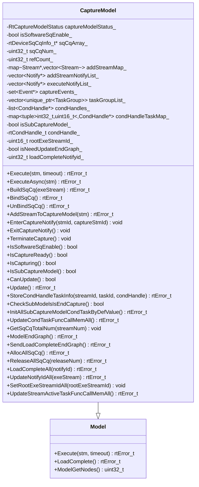

**关键代码**：

```cpp
// 文件位置：src/runtime/core/inc/model/capture_model.hpp:42-316
class CaptureModel : public Model {
public:
    explicit CaptureModel(ModelType type = RT_MODEL_CAPTURE_MODEL);
    ~CaptureModel() noexcept override;

    rtError_t Execute(Stream * const stm, int32_t timeout = -1) override;
    rtError_t ExecuteAsync(Stream * const stm) override;
    rtError_t TearDown() override;
    rtError_t AddStreamToCaptureModel(Stream * const stm);

    // 状态管理
    void SetCaptureModelStatus(RtCaptureModelStatus status);
    RtCaptureModelStatus GetCaptureModelStatus() const;
    void TerminateCapture();
    bool IsCaptureReady() const;
    bool IsCapturing() const;
    bool IsCaptureInvalid() const;
    bool CanUpdate() const;

    // SQ/CQ 管理
    bool IsSoftwareSqEnable(void) const;
    void SetSoftwareSqEnable(void);
    rtError_t BuildSqCq(Stream * const exeStream);
    void DeconstructSqCq(void);
    rtError_t ReleaseSqCq(uint32_t &releaseNum);

    // Notify 管理
    rtError_t SetNotifyBeforeExecute(Stream * const exeStm, CaptureModel* const captureMdl);
    rtError_t SetNotifyAfterExecute(Stream * const exeStm, CaptureModel* const captureMdl);
    void AddNotify(Notify *notify);
    void AddExeNotify(Notify *notify);

    // Event 管理
    void InsertCaptureEvent(Event * const event);
    std::set<Event *> GetCaptureEvent() const;
    rtError_t ResetCaptureEvents(Stream * const stm) const;

    // TaskGroup 管理
    void AddTaskGroupList(std::unique_ptr<TaskGroup> &taskGrp);
    void SetTaskGroupErrCode(const rtError_t errCode);
    const TaskGroup* GetTaskGroup(uint16_t streamId, uint16_t taskId);

    // 更新相关
    rtError_t Update(void);
    rtError_t RestoreForSoftwareSq(Device * const dev);

private:
    RtCaptureModelStatus captureModelStatus_{RtCaptureModelStatus::NONE};
    bool isSoftwareSqEnable_{false};
    rtDeviceSqCqInfo_t *sqCqArray_{nullptr};
    uint32_t sqCqNum_{0U};
    uint32_t refCount_{0U};
    std::map<Stream *, std::vector<Stream *>> addStreamMap_;
    std::vector<Notify *> addStreamNotifyList_;
    std::vector<Notify *> executeNotifyList_;
    std::set<Event *> captureEvents_;
    std::vector<std::unique_ptr<TaskGroup>> taskGroupList_;
    // ...
};
```

#### TaskGroup 任务组

**设计思想**：记录捕获过程中的任务序列，支持任务更新。

```cpp
// 文件位置：src/runtime/core/src/stream/stream.hpp:139-143
struct TaskGroup {
    std::vector<std::pair<uint16_t, uint16_t>> taskIds; // streamId + taskId
    bool isUpdate{false};
    uint32_t updateTaskIndex{0};
};
```

**任务组操作**：

```cpp
// 文件位置：src/runtime/feature/aclgraph/context_aclgraph.cc:622-688
rtError_t Context::StreamBeginTaskGrp(Stream * const stm)
{
    // 检查任务组状态
    const StreamTaskGroupStatus status = stm->GetTaskGroupStatus();
    COND_RETURN_ERROR_MSG_INNER(status != StreamTaskGroupStatus::NONE,
        RT_ERROR_STREAM_TASKGRP_STATUS,
        "Task group is repeatedly started, or a task group is being updated.");

    Stream *captureStream = stm->GetCaptureStream();
    CaptureModel *mdl = dynamic_cast<CaptureModel *>(captureStream->Model_());

    // 创建任务组
    std::unique_ptr<TaskGroup> taskGrp(new (std::nothrow) TaskGroup);
    // ...
    captureStream->UpdateCurrentTaskGroup(taskGrp);
    mdl->InsertTaskGroupStreamId(static_cast<uint16_t>(captureStream->Id_()));
    return RT_ERROR_NONE;
}

rtError_t Context::StreamEndTaskGrp(Stream * const stm, TaskGroup ** const handle) const
{
    Stream * const captureStream = stm->GetCaptureStream();
    CaptureModel *mdl = dynamic_cast<CaptureModel *>(captureStream->Model_());

    std::unique_ptr<TaskGroup> &taskGrp = captureStream->GetCurrentTaskGroup();
    
    rtError_t errorCode = mdl->GetTaskGroupErrCode();
    if ((errorCode != RT_ERROR_NONE) || (mdl->IsCaptureInvalid())) {
        taskGrp.reset();
        *handle = nullptr;
    } else {
        *handle = taskGrp.get();
        mdl->AddTaskGroupList(taskGrp);
    }
    captureStream->ResetTaskGroup();
    // ...
    return errorCode;
}
```

#### 捕获模式管理

**设计思想**：支持多线程捕获场景下的不同同步模式。

```cpp
// 文件位置：src/runtime/feature/aclgraph/context_aclgraph.cc:573-620
void Context::CaptureModeEnter(Stream * const stm, rtStreamCaptureMode mode)
{
    stm->SetStreamCaptureMode(mode);
    stm->SetBeginCaptureThreadId(runtime::GetCurrentTid());
    captureModeRefNum_[mode]++;
    InnerThreadLocalContainer::ThreadCaptureModeEnter(mode);

    // 更新 Context 级别捕获模式（取最小值）
    if (mode < GetContextCaptureMode()) {
        SetContextCaptureMode(mode);
    }
}

void Context::CaptureModeExit(Stream * const stm)
{
    const rtStreamCaptureMode streamCaptureMode = stm->GetStreamCaptureMode();
    stm->SetStreamCaptureMode(RT_STREAM_CAPTURE_MODE_MAX);
    stm->SetBeginCaptureThreadId(UINT32_MAX);

    if (captureModeRefNum_[streamCaptureMode] > 0U) {
        captureModeRefNum_[streamCaptureMode]--;
    }

    InnerThreadLocalContainer::ThreadCaptureModeExit(streamCaptureMode);

    // 根据引用计数更新 Context 级别捕获模式
    // ...
}
```

#### Event 捕获机制

**设计思想**：在捕获过程中处理 Event 的 Record/Wait 操作。

```cpp
// 文件位置：src/runtime/feature/aclgraph/event_capture.cc:19-90
rtError_t Event::CaptureEventProcess(Stream * const stm)
{
    // 分配捕获任务
    TaskInfo *tsk = stm->AllocTask(&submitTask, TS_TASK_TYPE_EVENT_RECORD, errorReason);
    // ...

    // 分配 Event 地址
    error = dev->AllocExpandingPoolEvent(&eventAddr, &newEventId);
    eventAddr_ = eventAddr;
    eventId_ = newEventId;

    // 初始化 MemWriteValue 任务
    (void)MemWriteValueTaskInit(tsk, eventAddr, static_cast<uint64_t>(1U));
    tsk->typeName = "EVENT_RECORD";
    tsk->type = TS_TASK_TYPE_CAPTURE_RECORD;
    // ...
    return error;
}

rtError_t Event::CaptureWaitProcess(Stream * const stm)
{
    TaskInfo *tsk = stm->AllocTask(&submitTask, TS_TASK_TYPE_STREAM_WAIT_EVENT, errorReason, MEM_WAIT_SQE_NUM);
    // ...

    tsk->typeName = "EVENT_WAIT";
    tsk->type = TS_TASK_TYPE_CAPTURE_WAIT;
    error = MemWaitValueTaskInit(tsk, eventAddr, 1, 0x0);
    // ...
    return error;
}
```

#### Software SQ 动态绑定

**设计思想**：支持 SQ/CQ 的动态绑定，实现高效的图执行。

```cpp
// 文件位置：src/runtime/feature/aclgraph/capture_model.cc:471-567
rtError_t CaptureModel::BuildSqCq(Stream * const exeStream)
{
    // 检查是否启用 Software Sq
    COND_PROC(!IsSoftwareSqEnable(), return RT_ERROR_NONE);
    // ...

    const uint32_t streamNum = static_cast<uint32_t>(StreamList_().size());
    
    // 分配 SQ/CQ 资源
    rtError_t error = AllocSqCqProc(streamNum);
    // ...

    sqCqNum_ = streamNum;

    // 分配 SQ 地址
    error = AllocSqAddr();
    // ...

    // 绑定 SQ/CQ 并发送 SQE
    error = BindSqCqAndSendSqe();
    // ...

    // 更新 Stream Active 任务
    error = UpdateStreamActiveTaskFuncCallMem();

    refCount_++;
    return RT_ERROR_NONE;
}

rtError_t CaptureModel::BindSqCq(void)
{
    // 更新流的 SQ/CQ 信息
    for (auto stm : StreamList_()) {
        stm->UpdateSqCq(&(sqCqArray_[index]));
        switchInfo_[index].stream_id = static_cast<uint32_t>(stm->Id_());
        switchInfo_[index].sq_id = stm->GetSqId();
        switchInfo_[index].sq_depth = stm->GetSqDepth();
        // ...
    }

    // 批量切换流到 SQ
    error = dev->Driver_()->SqSwitchStreamBatch(dev->Id_(), switchInfo_, sqCqNum_);
    return error;
}
```

#### CondHandle 条件句柄

**设计思想**：管理条件控制流的条件值（device 内存）和子模型列表，实现 IF/WHILE/SWITCH 动态分支执行。每个 CondHandle 归属于一个父 CaptureModel，管理多个子 CaptureModel，所有子模型共用同一个 Notify 资源。

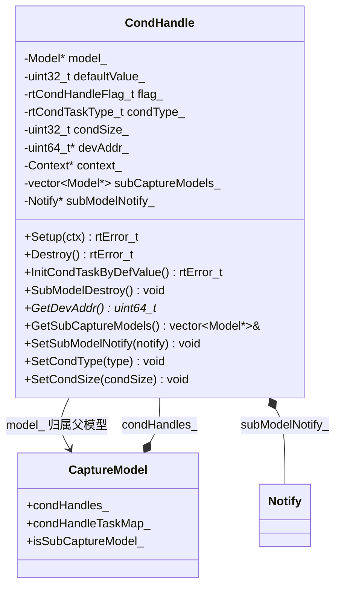

**关键代码**：

```cpp
// 文件位置：src/runtime/core/inc/cond_handle/cond_handle.hpp:22-101
class CondHandle : public NoCopy {
public:
    explicit CondHandle(Model *mdl, uint32_t defaultValue, rtCondHandleFlag_t flag);
    ~CondHandle() noexcept override;

    rtError_t Setup(Context *ctx);
    rtError_t Destroy();
    rtError_t InitCondTaskByDefValue();
    void SubModelDestroy();
    // ...
private:
    Model *model_{nullptr};              // 归属的父模型
    uint32_t defaultValue_{0U};          // 父模型执行时的默认条件值
    rtCondHandleFlag_t flag_;            // ASSIGN_DEFAULT 表示执行时初始化条件值
    rtCondTaskType_t condType_{RT_COND_TASK_TYPE_MAX}; // 条件类型
    uint32_t condSize_{0U};              // 子模型个数
    uint64_t *devAddr_{nullptr};         // device ptr，存储条件值
    Context *context_{nullptr};
    std::vector<Model *> subCaptureModels_; // 当前condHandle的子模型列表
    Notify *subModelNotify_{nullptr};    // 所有子模型共用同一个notify
};
```

**CondHandle 生命周期**：
- **创建**：`aclmdlRICondHandleCreate` → `new CondHandle` → `Setup`（分配 device 内存）→ `ModelPushBackCondHandle`（加入父模型）
- **使用**：`aclmdlRIAddCondTask` → 创建子模型 → 下发条件任务 → `StoreCondHandleTaskInfo`（记录到 `condHandleTaskMap_`）
- **执行**：`InitAllSubCaptureModelCondTaskByDefValue` 初始化条件值
- **销毁**：`CondHandle::~CondHandle` → 释放子模型 → 释放 device 内存

#### 子模型资源管理

**设计思想**：Cond 场景下，父模型 BuildSqCq 需要处理所有子模型的 EndGraph、SQ/CQ 分配、Notify 更新、条件任务刷新等操作。所有子模型资源随父模型一起申请和释放。

```cpp
// 文件位置：src/runtime/feature/aclgraph/capture_model.cc:553-625
rtError_t CaptureModel::BuildSqCq(Stream * const exeStream)
{
    COND_PROC(!IsSoftwareSqEnable(), return RT_ERROR_NONE);
    // ...
    // 阶段一：EndGraph + Notify 申请
    error = SendLoadCompleteEndGraph();
    // 阶段二：SQ/CQ 申请
    error = AllocAllSqCq();
    // 阶段三：刷新 Notify record/wait SQE
    error = UpdateNotifyIdAll(exeStream);
    SetRootExeStreamIdAll(static_cast<uint32_t>(exeStream->Id_()));
    error = LoadCompleteAll(loadCompleteNotifyId_);
    // 阶段四：刷新 Stream Active 条件算子
    error = UpdateStreamActiveTaskFuncCallMemAll();
    // 阶段五：刷新 Cond Task 条件算子
    error = UpdateCondTaskFuncCallMemAll();
    refCount_++;
    return RT_ERROR_NONE;
}
```

**条件任务 SQE 结构**：

| SQE 序号 | 名称 | 说明 | 适用类型 |
|----------|------|------|----------|
| SQE[0] | CondFirst | 条件判断 FunctionCall | IF/WHILE/SWITCH |
| SQE[1] | NotifyWait | 子模型完成通知等待 | IF/WHILE/SWITCH |
| SQE[2] | JumpBack | 跳回循环头部 | 仅 WHILE |

```cpp
// 文件位置：src/runtime/core/src/task/inc/aclgraph_cond_task.h:20-24
constexpr uint8_t COND_TASK_IF_SWITCH_SQE_NUM = 2U; // IF/SWITCH 使用 2 个 SQE
constexpr uint8_t COND_TASK_WHILE_SQE_NUM = 3U;     // WHILE 使用 3 个 SQE

// 文件位置：src/runtime/core/inc/task/task_info_struct.hpp:493-520
struct CaptureConditionTaskInfo {
    CondHandle *condHandle;             // 条件操作 Handle
    void *funcCallSvmMem;               // FunctionCall 指令设备内存
    void *headSqArrPtrArrSvmMem;        // 每个模型 sq list 首地址的指针数组
    void *modelSqCountArrSvmMem;        // 每个模型的 sq 数量数组
    void *streamSvmPtrArrSvmMem;        // 每个模型 svm list 首地址的指针数组
    uint32_t notifyId;                  // notify_id
    uint32_t notifyTimeout;             // timeout
    void *jumpBackFuncCallSvmMem;       // JumpBack FunctionCall（仅 WHILE）
    // ...
};
```

### 4.3 模块职责划分

| 模块 | 职责 | 位置 |
|------|------|------|
| CaptureModel | 捕获模型管理、SQ/CQ 管理、执行调度、子模型管理 | `core/inc/model/capture_model.hpp` |
| Context | 捕获流程控制、捕获模式管理、条件任务创建与提交 | `feature/aclgraph/context_aclgraph.cc` |
| Stream | 捕获状态管理、任务分配、级联流管理 | `feature/aclgraph/stream_capture.cc` |
| Event | 事件捕获处理 | `feature/aclgraph/event_capture.cc` |
| CondHandle | 条件句柄管理、条件值 device 内存、子模型生命周期 | `core/inc/cond_handle/cond_handle.hpp` |
| CondTask | 条件任务初始化、SQE 构建、FuncCall 重构 | `core/src/task/inc/aclgraph_cond_task.h` |
| CaptureModelUtils | 辅助函数（检查、获取捕获流等） | `feature/aclgraph/capture_model_utils.cc` |
| Notify | 执行前/后同步、子模型 EndGraph 通知 | `capture_model.cc` |

### 4.4 核心数据结构

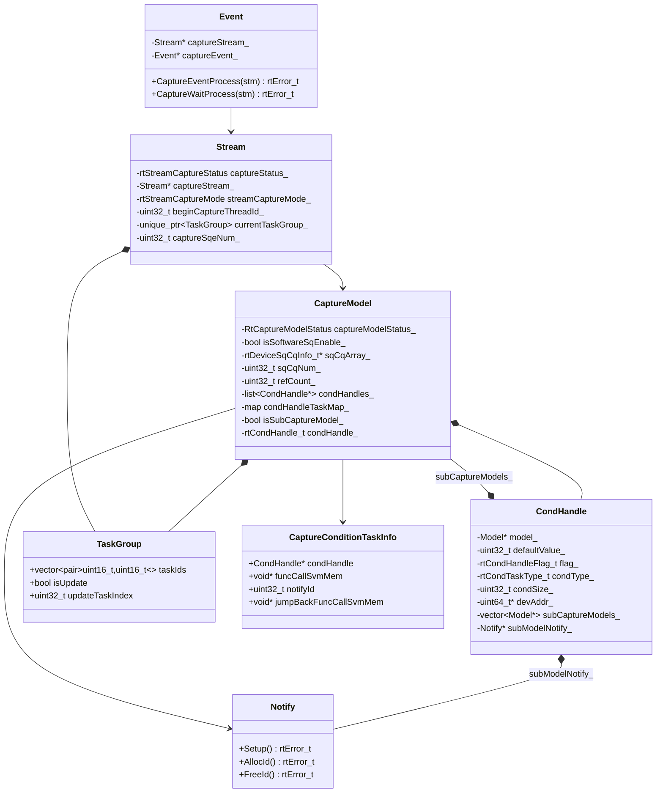

## 5. 关键设计思想

### 5.1 捕获与执行分离

- **捕获阶段**：任务被记录到 CaptureStream，不立即执行
- **构建阶段**：EndCapture 时构建可执行的图结构
- **执行阶段**：BuildSqCq 动态绑定 SQ/CQ，提交优化后的执行任务

### 5.2 级联捕获支持

当原始捕获流的 SQ 深度不足时，自动创建级联流继续捕获：

```cpp
// SQ 深度检查
if ((curCaptureStream->GetCaptureSqeNum() + reserved) >= curCaptureStream->GetSqDepth()) {
    // 创建级联流
    AllocCascadeCaptureStream(newCaptureStream, curCaptureStream);
    // Stream Active 连接级联流
    CondStreamActive(newCaptureStream, curCaptureStream);
    // 更新捕获流信息
    UpdateCascadeCaptureStreamInfo(newCaptureStream, curCaptureStream);
}
```

### 5.3 Software SQ 动态绑定

- 支持 SQ/CQ 的动态分配和绑定
- 执行时 BuildSqCq，完成后 ReleaseSqCq
- 通过 SqSwitchStreamBatch 实现批量流切换

### 5.4 Notify 同步机制

执行时通过 Notify 实现与 AddStream 的同步：

```cpp
// 执行前同步：等待 AddStream 完成当前任务
SetNotifyBeforeExecute(exeStream, captureModel);
// NotifyRecord(addStream) -> NotifyWait(exeStream)

// 执行后同步：通知 AddStream 继续执行
SetNotifyAfterExecute(exeStream, captureModel);
// NotifyRecord(exeStream) -> NotifyWait(addStream)
```

### 5.5 捕获模式控制

| 模式 | 说明 | 适用场景 |
|------|------|----------|
| GLOBAL | 所有线程共享捕获状态 | 单线程捕获 |
| THREAD_LOCAL | 仅当前线程可操作 | 多线程独立捕获 |
| RELAXED | 允许其他线程操作 | 多线程协作捕获 |

### 5.6 条件控制流设计

**父子模型关系**：

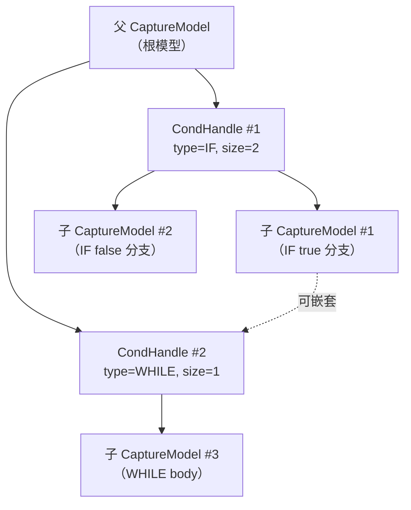

**关键设计决策**：

1. **子模型共用 Notify**：同一 CondHandle 下的所有子模型共享一个 Notify 资源，避免重复申请。Notify id 在模型执行时统一申请和刷新。
2. **子模型资源随父模型管理**：子模型的 SQ/CQ、Notify 申请和释放都由父模型处理（`AllocAllSqCq`、`ReleaseAllSqCq` 等），子模型不单独释放资源。
3. **子模型流管理**：EndCapture 阶段遍历子模型，调用 `ModelAddStream` 将子模型流添加到父模型中（不加到 `headStreams_`），用于模型执行时的资源申请和释放。
4. **EndCapture 同步检查**：父模型 EndCapture 时通过 `CheckSubModelsIsEndCapture` 检查所有子模型是否已完成 EndCapture，未完成则返回 `ACL_ERROR_RT_SUB_ACLGRAPH_IS_CAPTURING`。
5. **条件值初始化**：模型执行前通过 `InitAllSubCaptureModelCondTaskByDefValue` 初始化所有 CondHandle 的条件值（当 flag 为 `ACL_MODEL_RI_COND_HANDLE_ASSIGN_DEFAULT` 时）。
6. **条件任务 SQE 刷新**：模型执行时通过 `UpdateCondTaskFuncCallMemAll` 重构条件任务的 FunctionCall 内存，更新 SQ list、SVM list 等设备内存地址。

## 6. 关键文件索引

| 模块 | 文件路径 | 核心内容 |
|------|----------|----------|
| 捕获模型 | `src/runtime/core/inc/model/capture_model.hpp` | CaptureModel 类定义 |
| 捕获模型实现 | `src/runtime/feature/aclgraph/capture_model.cc` | CaptureModel 实现（含子模型管理） |
| 上下文捕获 | `src/runtime/feature/aclgraph/context_aclgraph.cc` | BeginCapture/EndCapture/CondTask 流程 |
| 流捕获 | `src/runtime/feature/aclgraph/stream_capture.cc` | AllocCaptureTask、级联流管理 |
| 事件捕获 | `src/runtime/feature/aclgraph/event_capture.cc` | Event 捕获处理 |
| 条件句柄定义 | `src/runtime/core/inc/cond_handle/cond_handle.hpp` | CondHandle 类定义 |
| 条件句柄实现 | `src/runtime/feature/aclgraph/cond_handle.cc` | CondHandle 实现 |
| 条件任务定义 | `src/runtime/core/src/task/inc/aclgraph_cond_task.h` | 条件任务 SQE 常量与接口 |
| 条件任务实现 | `src/runtime/core/src/task/task_info/aclgraph_cond_task.cc` | 条件任务初始化与 SQE 构建 |
| 条件任务下发 | `src/runtime/core/src/launch/cond_starsv2.cc` | 条件任务提交与后处理 |
| 数据类型定义 | `src/inc/runtime/rt_inner_model.h` | runtime 层条件控制流类型定义 |
| ACL 数据类型 | `include/external/acl/acl_rt.h` | aclmdlRICondHandle、aclmdlRICondTaskParams 等 ACL 类型 |
| 捕获工具 | `src/runtime/feature/aclgraph/capture_model_utils.cc` | 辅助函数 |
| 模型打印 | `src/runtime/feature/aclgraph/model_aclgraph.cc` | DebugDotPrint、JsonPrint |
| Runtime API 接口 | `src/runtime/api/api_c_standard_soc.cc:674-819` | aclmdlRICaptureBegin/EndCapture/CondHandleCreate 等 runtime 层实现 |
| ACL RI 接口 | `src/acl/aclrt_impl/model_ri.cpp` | aclmdlRICaptureBegin/End/CondHandleCreate 等 ACL 层接口 |
| v100适配 | `src/runtime/feature/aclgraph/v100/` | v100 芯片适配 |
| v200适配 | `src/runtime/feature/aclgraph/v200/` | v200 芯片适配 |

## 7. 兼容性与扩展性

### 7.1 芯片适配

- **v100 适配**：`feature/aclgraph/v100/` 目录
- **v200 适配**：`feature/aclgraph/v200/` 目录
- 通过 `CaptureAdapt` 类实现不同芯片的适配

### 7.2 状态转换

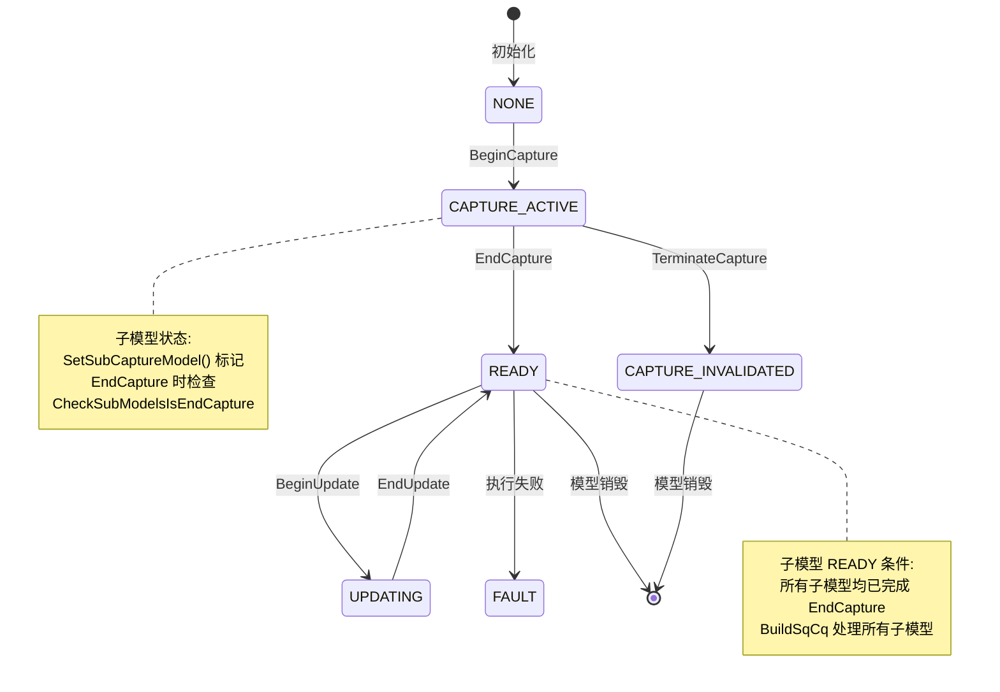

### 7.3 扩展能力

- **级联流扩展**：支持无限级联流扩展捕获深度
- **TaskGroup 更新**：支持捕获后的任务参数更新
- **模型更新**：支持捕获模型的动态更新
- **条件控制流嵌套**：子模型内部可继续创建 CondHandle，支持多级条件嵌套（处理）

---

_本特性文档基于源码 `src/runtime/feature/aclgraph/`、`src/runtime/core/inc/model/capture_model.hpp`、`src/runtime/core/inc/cond_handle/cond_handle.hpp`、`src/acl/aclrt_impl/model_ri.cpp` 及 `include/external/acl/acl_rt.h` 分析。_