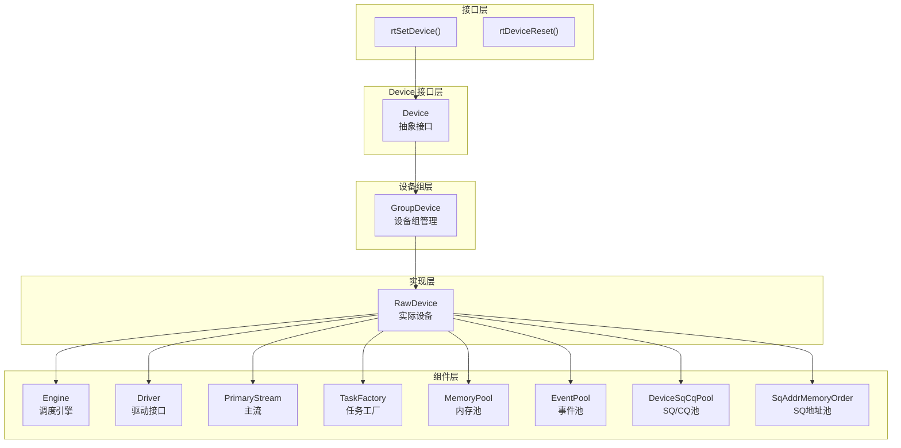
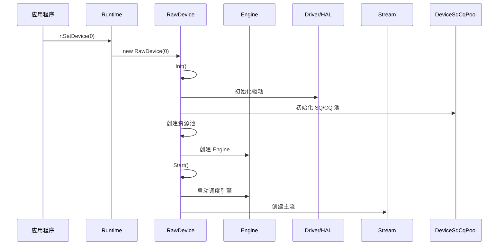
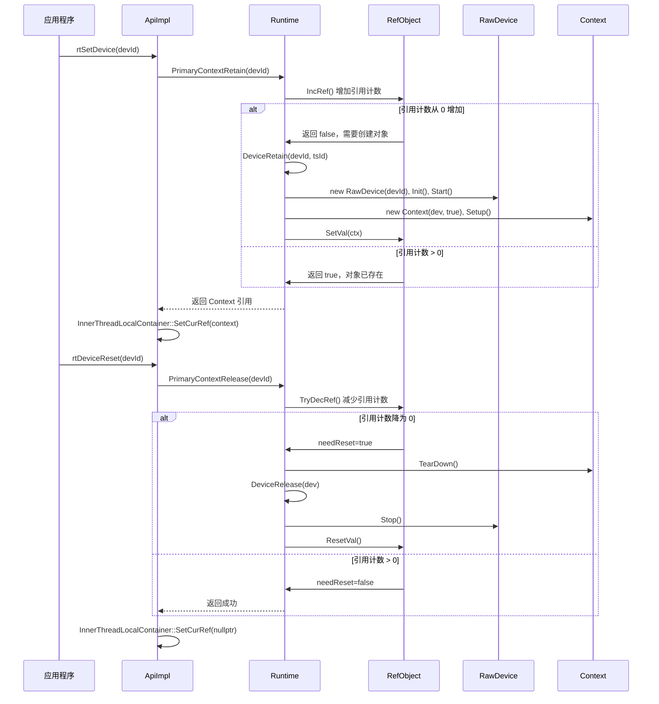
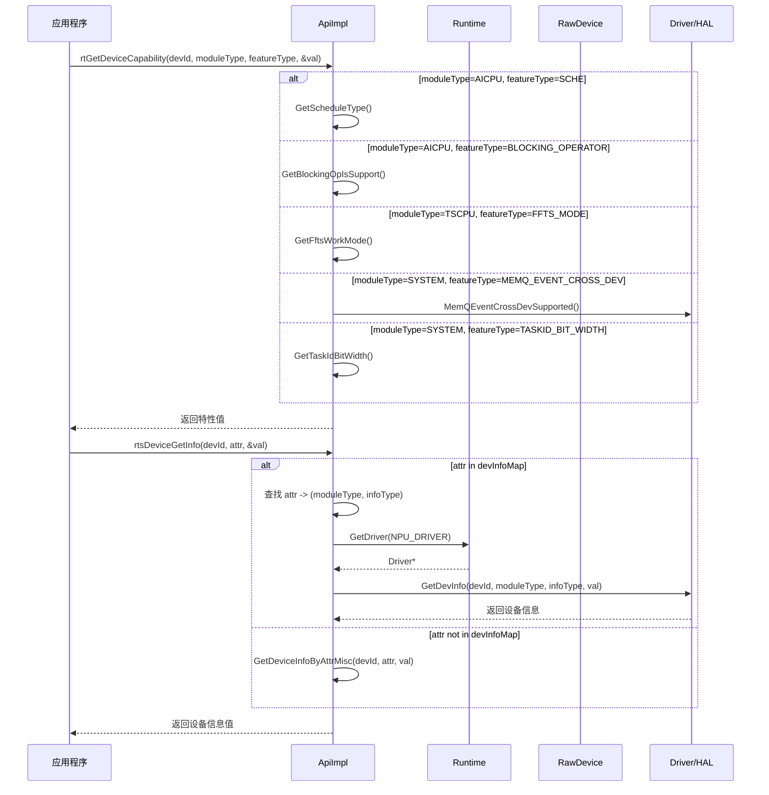
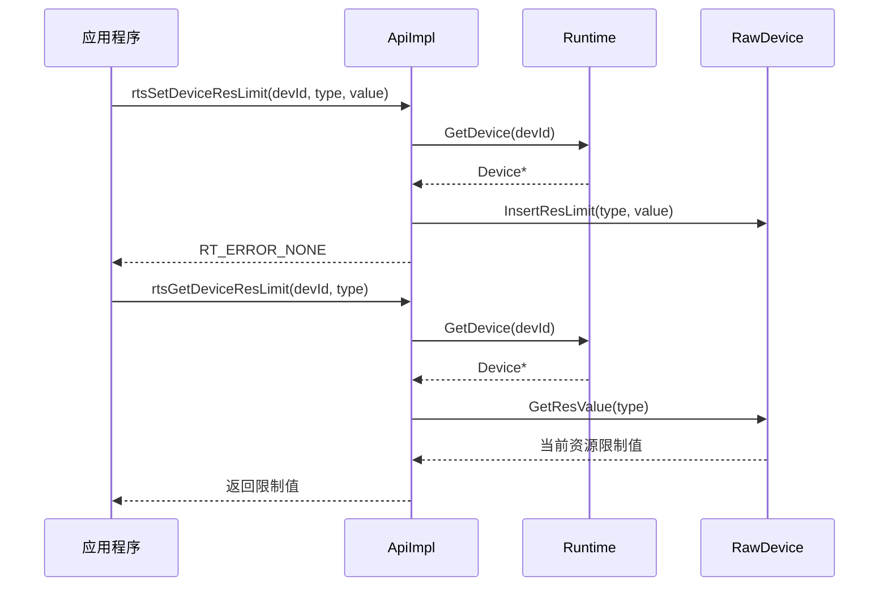
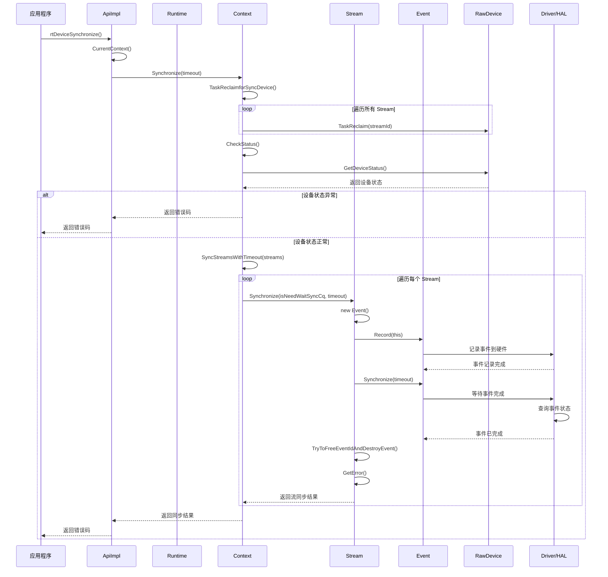
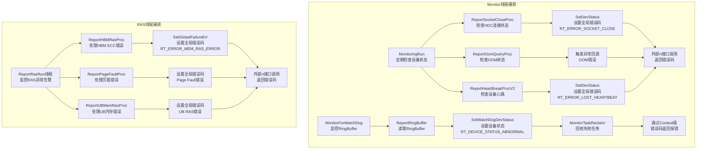
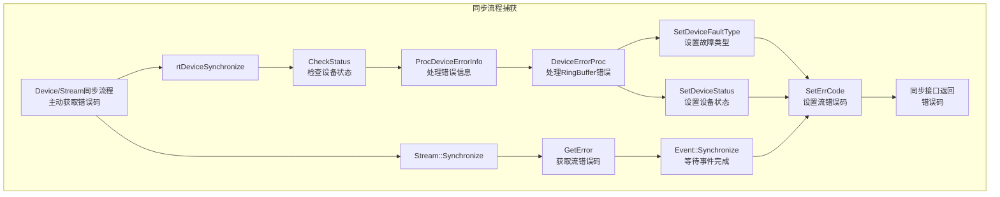
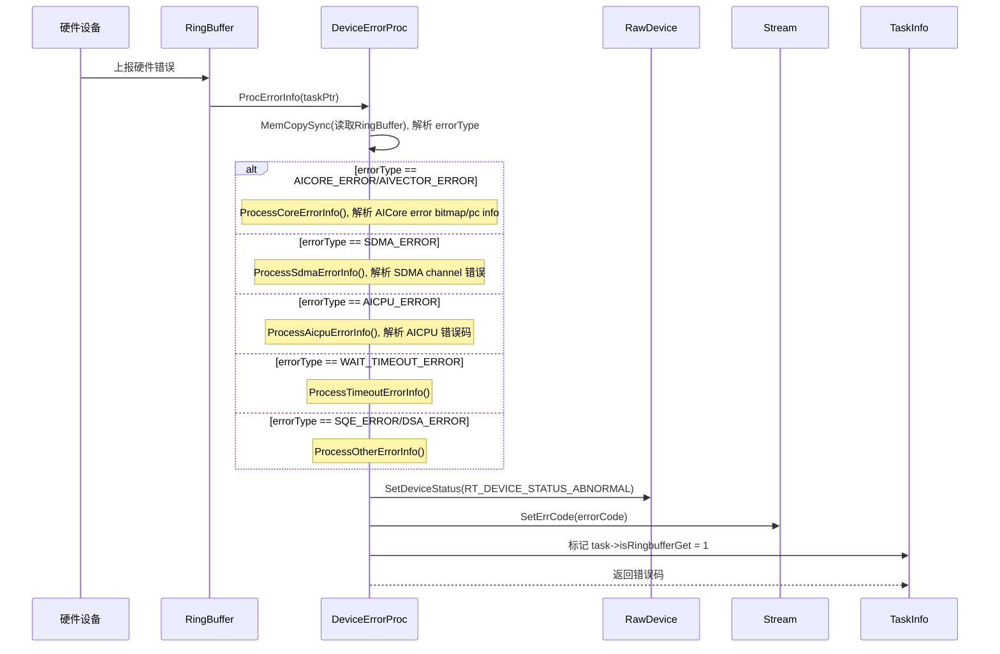
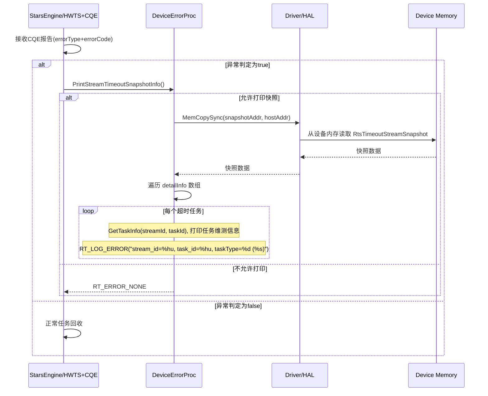

# Device 模块架构

## 1. 模块概述

- **功能介绍**：Device 模块负责管理昇腾 AI 处理器的设备资源，包括设备初始化、启动、停止、状态管理、任务提交、资源池管理等功能。采用三层继承结构：Device（接口）→ GroupDevice（设备组）→ RawDevice（实际设备）。
- **设计目标**：
  - 提供统一的设备管理接口
  - 管理设备生命周期（初始化、运行、停止）
  - 提供任务提交和回收机制
  - 管理设备资源池（Event、Memory、SQ/CQ 等）
  - 支持设备错误处理和状态回调

## 2. 使用场景与对外接口

### 2.1 使用场景

- **场景一**：设置当前计算设备
  ```cpp
  rtError_t err = rtSetDevice(0);
  // Runtime::DeviceRetain(0) → Device::Init() → Device::Start()
  ```
  `rtSetDevice()` 用于设置当前线程的设备 ID。由于大多数 `rt`/`aclrt` 接口不携带设备 ID 参数，设置后当前线程将默认在该设备上执行后续操作，实现线程级设备上下文的绑定。

- **场景二**：获取设备能力信息
  
  **获取设备能力特性**：
  ```cpp
  int32_t val;
  rtError_t ret = rtGetDeviceCapability(0, RT_MODULE_TYPE_AICORE, FEATURE_TYPE_SCHE, &val);
  if (ret != RT_ERROR_NONE) {
      // 获取失败
  }
  // val 包含 AI Core 的调度能力信息
  ```
  | 参数 | 说明 |
  |------|------|
  | `moduleType` | 模块类型，如 `RT_MODULE_TYPE_AICORE`、`RT_MODULE_TYPE_AICPU`、`RT_MODULE_TYPE_TSCPU` 等 |
  | `featureType` | 特性类型，如 `FEATURE_TYPE_SCHE`（调度能力）、`FEATURE_TYPE_BLOCKING_OPERATOR`（阻塞算子）等 |

- **场景三**：设备状态监控与异常处理
  
  **设备状态查询**：
  ```cpp
  rtDeviceStatus deviceStatus;
  rtError_t ret = rtDeviceStatusQuery(0, &deviceStatus);
  if (ret != RT_ERROR_NONE || deviceStatus != RT_DEVICE_STATUS_NORMAL) {
      // 设备异常，需进一步排查故障原因
  }
  ```
  
  `rtDeviceStatus` 状态值：
  | 状态值 | 含义 |
  |--------|------|
  | `RT_DEVICE_STATUS_NORMAL` | 设备正常运行 |
  | `RT_DEVICE_STATUS_ABNORMAL` | 设备异常，需排查故障 |
  
  **设备同步与错误捕获**：
  ```cpp
  rtError_t ret = rtDeviceSynchronize();
  if (ret != RT_ERROR_NONE) {
      // 任务执行失败，同步接口返回错误码
      // 上层可根据错误码类型进行针对性处理
  }
  // 设备上所有任务成功完成
  ```

### 2.2 对外接口

| 接口 | 文件位置 | 说明 |
|------|----------|------|
| `rtSetDevice()` | `src/runtime/api/api_c_device.cc` | 设置当前设备 |
| `rtDeviceReset()` | `src/runtime/api/api_c_device.cc` | 重置设备 |
| `rtGetDevice()` | `src/runtime/api/api_c_device.cc` | 获取当前设备 ID |
| `rtGetDeviceCapability()` | `src/runtime/api/api_c_device.cc` | 获取设备能力 |
| `rtsDeviceGetInfo()` | `src/runtime/api/api_c_device.cc` | 获取设备信息 |
| `rtsGetDeviceResLimit()` | `src/runtime/api/api_c_device.cc` | 获取设备资源限制值 |
| `rtsSetDeviceResLimit()` | `src/runtime/api/api_c_device.cc` | 设置设备资源限制 |
| `rtsResetDeviceResLimit()` | `src/runtime/api/api_c_device.cc` | 重置设备资源限制 |
| `rtSetDeviceFailureMode()` | `src/runtime/api/api_c_device.cc` | 设置设备故障模式 |
| `rtDeviceSynchronize()` | `src/runtime/api/api_c_device.cc` | 设备同步 |
| `rtDeviceStatusQuery()` | `src/runtime/api/api_c_device.cc` | 查询设备状态 |

## 3. 架构总览

### 整体设计思路

Device 采用三层继承结构实现设备管理：抽象接口层（Device）定义所有核心方法，中间层（GroupDevice）处理设备组管理，底层（RawDevice）实现具体设备操作。每个 Device 包含 Engine（调度引擎）、Driver（驱动）、Stream（主流）、DeviceSqCqPool（SQ/CQ池）、SqAddrMemoryOrder（SQ地址内存池）等核心组件。

### 架构分层图



### 核心模块交互图

## 4. 详细设计

### 4.1 设备初始化流程

#### 设备初始化交互



#### rtSetDevice/rtDeviceReset 引用计数机制

**设计思想**：使用 `RefObject` 类实现线程安全的引用计数，支持多线程并发访问。引用计数管理 Device 和 Context 对象的生命周期，只有当引用计数降为 0 时才真正销毁对象。

**引用计数流程**：



#### 线程局部变量设置

**设计思想**：使用 `InnerThreadLocalContainer` 管理线程级设备上下文，确保多线程环境下每个线程有独立的设备绑定。

**rtSetDevice 设置的线程变量**：

```cpp
// 文件位置：src/runtime/core/inc/common/inner_thread_local.hpp
class InnerThreadLocalContainer {
private:
    static __THREAD_LOCAL__ Context *curCtx_;         // 当前 Context
    static __THREAD_LOCAL__ RefObject<Context *> *curRef_;  // Context 引用对象
    static __THREAD_LOCAL__ Device *device_;          // 当前 Device
    static __THREAD_LOCAL__ uint32_t lastTaskId_;     // 最近任务 ID
    static __THREAD_LOCAL__ uint32_t lastStreamId_;   // 最近流 ID
    static __THREAD_LOCAL__ rtError_t globalError_;   // 全局错误码
};
```

**多线程并发安全**：
- 每个线程有独立的设备上下文，互不干扰
- 引用计数使用原子操作，保证多线程安全

### 4.2 设备能力信息获取

设备能力信息获取接口提供多种查询能力，包括硬件能力特性查询、设备资源配置等，为上层应用提供设备特性感知和配置能力。

#### 设备能力查询流程



**rtGetDeviceCapability 入参类型枚举**：

```cpp
// 文件位置：pkg_inc/runtime/runtime/dev.h
typedef enum tagRtDeviceModuleType {
    RT_MODULE_TYPE_SYSTEM = 0,      // 系统信息
    RT_MODULE_TYPE_AICPU,           // AICPU 信息
    RT_MODULE_TYPE_CCPU,            // CCPU 信息
    RT_MODULE_TYPE_DCPU,            // DCPU 信息
    RT_MODULE_TYPE_AICORE,          // AI Core 信息
    RT_MODULE_TYPE_TSCPU,           // TSCPU 信息
    RT_MODULE_TYPE_PCIE,            // PCIe 信息
    RT_MODULE_TYPE_VECTOR_CORE,     // Vector Core 信息
    RT_MODULE_TYPE_HOST_AICPU,      // Host AICPU 信息
    RT_MODULE_TYPE_QOS,             // QoS 信息
    RT_MODULE_TYPE_MEMORY           // 内存信息
} rtModuleType_t;

typedef enum tagRtDeviceFeatureType {
    FEATURE_TYPE_SCHE,                    // 调度能力
    FEATURE_TYPE_BLOCKING_OPERATOR,       // 阻塞算子支持
    FEATURE_TYPE_FFTS_MODE,               // FFTS 工作模式
    FEATURE_TYPE_MEMQ_EVENT_CROSS_DEV,    // 跨设备事件支持
    FEATURE_TYPE_MODEL_TASK_UPDATE,       // 模型任务更新支持
    FEATURE_TYPE_END,
} rtDeviceFeatureType_t;
```

**rtsDeviceGetInfo 入参类型枚举**：

```cpp
// 文件位置：pkg_inc/runtime/runtime/rts/rts_device.h
typedef enum { 
    RT_DEV_ATTR_AICPU_CORE_NUM  = 1U,         // AICPU 核心数量
    RT_DEV_ATTR_AICORE_CORE_NUM = 101U,       // AI Core 核心数量
    RT_DEV_ATTR_CUBE_CORE_NUM   = 102U,       // Cube Core 核心数量
    
    RT_DEV_ATTR_VECTOR_CORE_NUM = 201U,       // Vector Core 核心数量
    RT_DEV_ATTR_WARP_SIZE       = 202U,       // Warp 大小
    RT_DEV_ATTR_MAX_THREAD_PER_VECTOR_CORE  = 203U,  // 每个 Vector Core 最大线程数
    RT_DEV_ATTR_UBUF_PER_VECTOR_CORE   = 204U,       // 每个 Vector Core 的 UB 缓存大小
    
    RT_DEV_ATTR_TOTAL_GLOBAL_MEM_SIZE   = 301U,      // 全局内存总大小
    RT_DEV_ATTR_L2_CACHE_SIZE           = 302U,      // L2 缓存大小
    
    RT_DEV_ATTR_SMP_ID = 401U,                      // SMP ID（设备是否在同一 OS）
    RT_DEV_ATTR_PHY_CHIP_ID = 402U,                 // 物理芯片 ID
    RT_DEV_ATTR_IS_VIRTUAL = 501U,                  // 是否为虚拟设备
    RT_DEV_ATTR_NPU_ARCH = 601U,                    // NPU 架构类型
    
    RT_DEV_ATTR_MAX
} rtDevAttr;
```

#### 设备资源限制管理流程



目前支持配置和获 取Cube Core 和 Vector Core 两种资源类型资源的限制：

```cpp
// 文件位置：pkg_inc/runtime/runtime/base.h
typedef enum {
    RT_DEV_RES_CUBE_CORE = 0,      // Cube Core 资源限制
    RT_DEV_RES_VECTOR_CORE,        // Vector Core 资源限制
    RT_DEV_RES_TYPE_MAX
} rtDevResLimitType_t;
```

### 4.3 设备同步

#### rtDeviceSynchronize 调用流程

**设计思想**：设备同步接口通过等待设备上所有任务完成，实现阻塞式同步，同时捕获任务执行过程中的错误状态。同步过程中会对所有 Stream 进行任务回收、状态检查和等待，确保上层应用能及时感知设备执行异常。



### 4.4 异常处理

**设计思想**：Runtime 提供多层次的错误捕获机制，从任务执行、流同步、设备同步到应用程序接口调用，每个层级都能捕获并传递错误信息。异常处理采用分支分发模式，根据错误类型路由到专门的处理函数。维测信息通过 RingBuffer 从设备传递到主机，包含详细的错误上下文、任务信息、硬件状态等，通过日志系统输出供问题定位。

#### 错误捕获机制





**四种错误捕获机制对比**：

| 特性 | Monitor线程-设备状态 | Monitor线程-RingBuffer | RAS线程-RAS告警 | 同步流程主动检查 |
|------|----------------------|------------------------|----------------|------------------|
| **检查方式** | 定期轮询（1秒） | 定期读取RingBuffer（1秒） | 定期轮询（10ms） | 同步时主动调用 |
| **错误来源** | HDC连接、心跳、OOM | RingBuffer上报 | 硬件RAS告警 | 设备/Stream状态 |
| **传递路径** | SetDevStatus → 外部接口 | SetWatchDogDevStatus → Context | SetGlobalFailureErr → 外部接口 | GetError → 直接返回 |
| **适用场景** | 设备离线、通信中断、OOM | 任务执行失败 | 硬件故障（HBM ECC、UB内存错误） | 任务执行异常捕获 |

#### 异常分支处理流程

DeviceErrorProc 从 RingBuffer 读取错误信息，根据不同的 `errorType` 和寄存器维测信息（如Error Bitmap、PC值、Channel ID等），路由到对应的错误处理函数分支，打印详细维测日志后设置故障类型并返回对应的错误码。

**异常分支处理时序图**：



不同类型的错误，处理函数映射表如下：

```cpp
// 文件位置：src/runtime/core/src/device/v100/device_error_proc.cc
static const std::map<uint64_t, DeviceErrorProc::StarsErrorInfoProc> starsFuncMap = {
    {AICORE_ERROR, &DeviceErrorProc::ProcessStarsCoreErrorInfo},
    {AIVECTOR_ERROR, &DeviceErrorProc::ProcessStarsCoreErrorInfo},
    {FFTS_PLUS_AICORE_ERROR, &DeviceErrorProc::ProcessStarsCoreErrorInfo},
    {FFTS_PLUS_AIVECTOR_ERROR, &DeviceErrorProc::ProcessStarsCoreErrorInfo},
    {WAIT_TIMEOUT_ERROR, &DeviceErrorProc::ProcessStarsWaitTimeoutErrorInfo},
    {SDMA_ERROR, &DeviceErrorProc::ProcessStarsSdmaErrorInfo},
    {AICPU_ERROR, &ProcessStarsAicpuErrorInfo},
    {FFTS_PLUS_SDMA_ERROR, &DeviceErrorProc::ProcessStarsSdmaErrorInfo},
    {FFTS_PLUS_AICPU_ERROR, &ProcessStarsAicpuErrorInfo},
    {DVPP_ERROR, &DeviceErrorProc::ProcessStarsDvppErrorInfo},
    {DSA_ERROR, &DeviceErrorProc::ProcessStarsDsaErrorInfo},
    {FFTS_PLUS_DSA_ERROR, &DeviceErrorProc::ProcessStarsDsaErrorInfo},
    {SQE_ERROR, &DeviceErrorProc::ProcessStarsSqeErrorInfo},
    {HCCL_FFTSPLUS_TIMEOUT_ERROR, &DeviceErrorProc::ProcessStarsHcclFftsPlusTimeoutErrorInfo},
    {AICORE_TIMEOUT_DFX, &DeviceErrorProc::ProcessStarsCoreTimeoutDfxInfo}
};
```

#### 任务异常快照维测

当任务执行异常时，Runtime 会通过 `PrintStreamTimeoutSnapshotInfo` 从设备内存读取超时任务的快照信息，打印详细的维测日志，帮助定位任务卡住或超时的原因。

**快照打印流程**：



**快照信息内容**：
- **基础信息**：`stream_id`、`task_id`、`taskType`（任务类型）
- **任务特定信息**：
  - EVENT_RECORD 任务：`EventId`
  - STREAM_WAIT_EVENT 任务：`EventId`
  - NOTIFY_RECORD 任务：`NotifyId`
  - NOTIFY_WAIT 任务：`NotifyId`、`waitType`
  - KERNEL 任务：`kernel_name`

---

_本模块文档基于源码 `src/runtime/core/src/device/` 分析。_