# Model 模块架构

## 1. 模块概述

- **功能介绍**：Model 模块负责管理计算图的执行模型，包括模型创建、Stream 绑定、任务加载、模型执行和销毁等全生命周期管理。支持普通模型（Normal Model）和捕获模型（Capture Model）两种类型，通过 SQ/CQ 机制实现任务调度和执行。
- **设计目标**：
  - 提供统一的模型管理接口
  - 支持多 Stream 绑定和调度
  - 实现 Task 的批量提交和执行
  - 支持 Label 分配和跳转控制
  - 提供模型执行同步/异步模式

## 2. 使用场景与对外接口

### 2.1 使用场景

- **场景一**：创建并执行计算模型（使用 ACL 接口）
  ```cpp
  aclmdlRI modelRI;
  aclmdlRIBuildBegin(&modelRI, 0);  // 开始构建模型
  aclmdlRIBindStream(modelRI, stream, ACL_MODEL_STREAM_FLAG_HEAD);  // 绑定 Stream
  // 添加任务到 stream
  aclmdlRIEndTask(modelRI, stream);  // 标记任务结束
  aclmdlRIBuildEnd(modelRI, nullptr);  // 结束构建
  aclmdlRIExecute(modelRI, -1);  // 同步执行
  aclmdlRIDestroy(modelRI);  // 销毁模型
  ```

- **场景二**：异步模型执行（使用 ACL 接口）
  ```cpp
  aclmdlRIExecuteAsync(modelRI, execStream);
  // 通过 Stream 同步等待执行完成
  aclrtSynchronizeStream(execStream);
  ```

### 2.2 对外接口

| ACL 接口 | 文件位置 | 说明 |
|----------|----------|------|
| `aclmdlRIBuildBegin()` | `include/external/acl/acl_rt.h`<br>`src/acl/aclrt_impl/model_ri.cpp` | 创建模型（开始构建） |
| `aclmdlRIDestroy()` | `include/external/acl/acl_rt.h`<br>`src/acl/aclrt_impl/model_ri.cpp` | 销毁模型 |
| `aclmdlRIBindStream()` | `include/external/acl/acl_rt.h`<br>`src/acl/aclrt_impl/model_ri.cpp` | 绑定 Stream 到模型 |
| `aclmdlRIUnbindStream()` | `include/external/acl/acl_rt.h`<br>`src/acl/aclrt_impl/model_ri.cpp` | 解绑 Stream |
| `aclmdlRIExecute()` | `include/external/acl/acl_rt.h`<br>`src/acl/aclrt_impl/model_ri.cpp` | 同步执行模型 |
| `aclmdlRIExecuteAsync()` |`include/external/acl/acl_rt.h`<br>`src/acl/aclrt_impl/model_ri.cpp` | 异步执行模型 |
| `aclmdlRIBuildEnd()` | `include/external/acl/acl_rt.h`<br>`src/acl/aclrt_impl/model_ri.cpp` | 完成模型构建（LoadComplete） |
| `aclmdlRIEndTask()` | `include/external/acl/acl_rt.h`<br>`src/acl/aclrt_impl/model_ri.cpp` | 标记任务结束 |
| `aclmdlRISetName()` | `include/external/acl/acl_rt.h`<br>`src/acl/aclrt_impl/model_ri.cpp` | 设置模型名称 |
| `aclmdlRIAbort()` |`include/external/acl/acl_rt.h`<br>`src/acl/aclrt_impl/model_ri.cpp` | 终止模型执行 |

## 3. 架构总览

### 3.1 整体设计思路

Model 采用两层继承结构：基类 Model 提供普通模型的完整功能。每个 Model 绑定多个 Stream，通过 ModelExecuteTask 提交执行任务，使用 Notify 实现执行完成通知。

| 设计点 | 说明 |
|--------|------|
| **Model 作为任务容器** | 绑定多个 Stream，统一管理 SQE 下发和执行 |
| **Stream 作为任务队列** | 每个 Stream 维护 SQ 任务序列，支持任务回收 |
| **Label 实现控制流** | Model 分配 Label ID，Stream 记录跳转点 |
| **headStreams 机制** | 标记入口 Stream，Execute 时从这里激活执行 |
| **执行流机制** | 下发模型执行任务，激活模型流执行 |

### 3.2 架构分层图

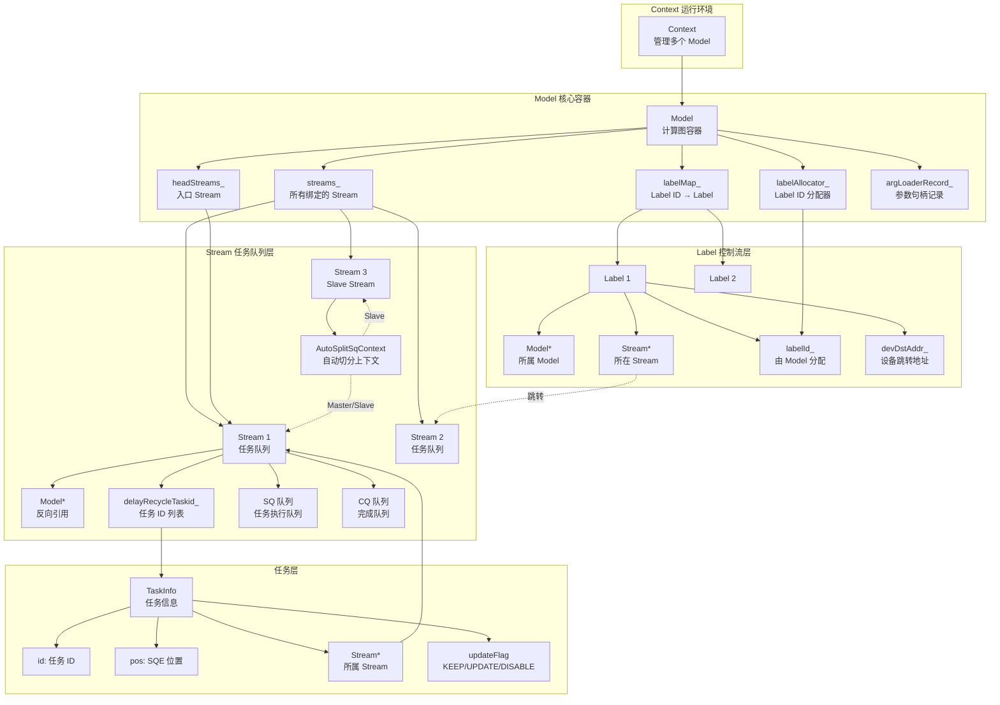

### 3.3 Model-Stream-Label 三层架构关系

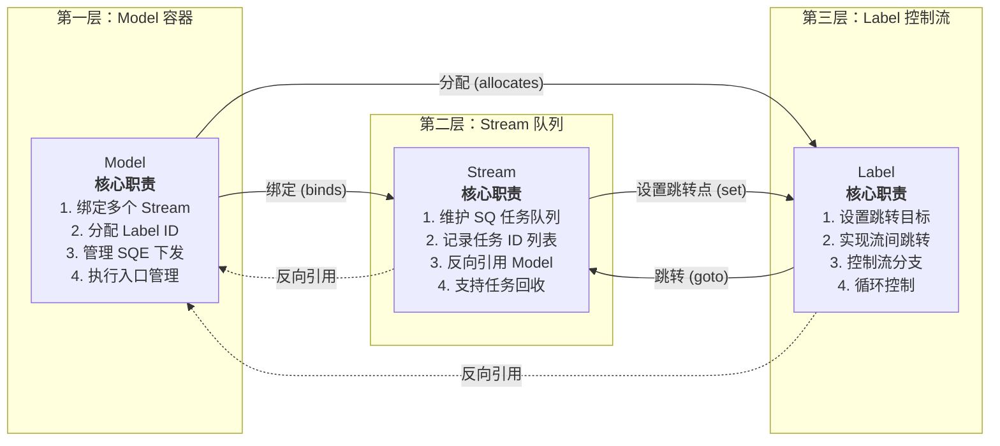

### 3.4 核心模块交互图（含硬件交互）

本节通过时序图展示 AutoSplit与非 AutoSplit 两种场景的关键差异。

#### 3.4.1 Stream 绑定阶段

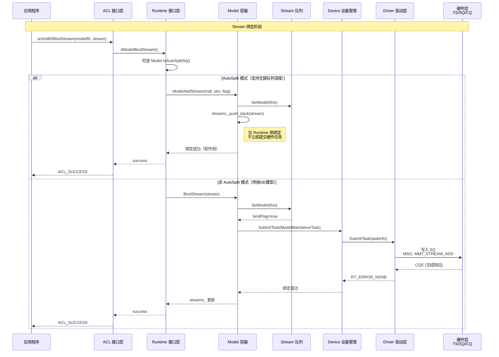

**差异说明**：
| 对比项 | AutoSplit 模式 | 非 AutoSplit 模式 |
|--------|----------------|-------------------|
| 绑定时机 | 仅 Runtime 侧软件绑定 | 立即提交硬件绑定任务 |
| 硬件交互 | LoadComplete 时才建立硬件关系 | 绑定时立即写入 SQ |
| 任务队列 | Host SQE buffer（可扩展） | 固定硬件 SQ |

#### 3.4.2 任务提交阶段

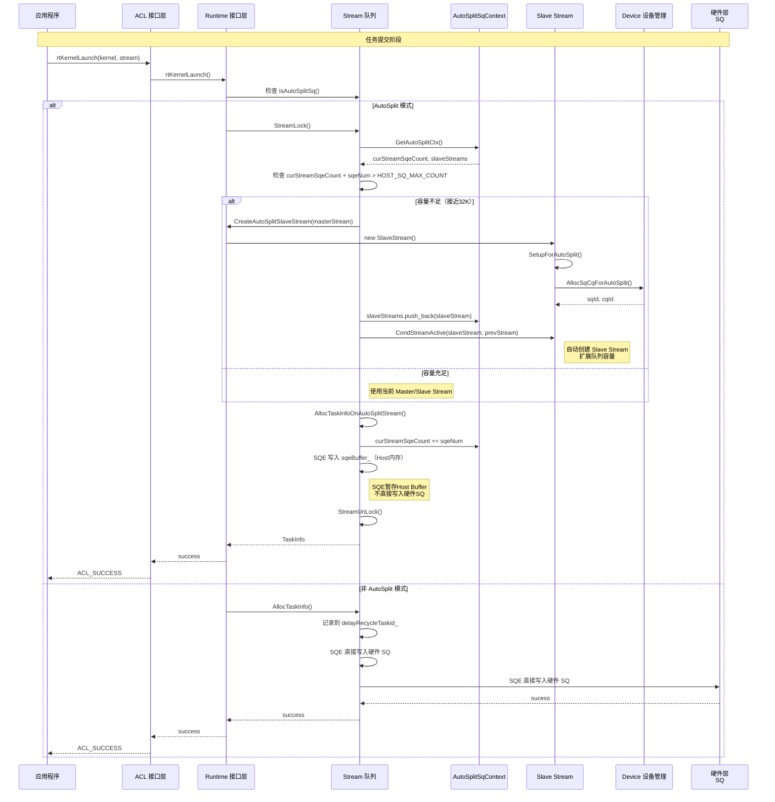

**差异说明**：
| 对比项 | AutoSplit 模式 | 非 AutoSplit 模式 |
|--------|----------------|-------------------|
| SQE存储位置 | Host sqeBuffer_ | 设备 SQ |
| 容量限制 | 无限制（Slave Stream 扩展） | 固定深度 |
| 提交时机 | LoadComplete 时批量下发 | 实时提交 |
| Slave Stream | 任务接近32K时自动创建 | 不支持 |

#### 3.4.3 EndGraph 标记阶段

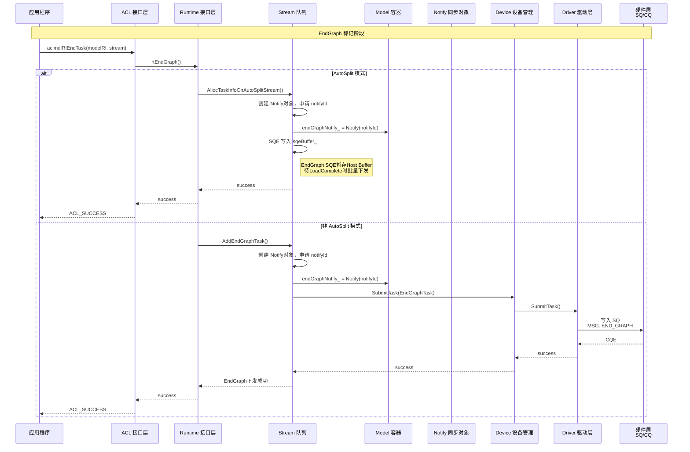

#### 3.4.4 LoadComplete 阶段

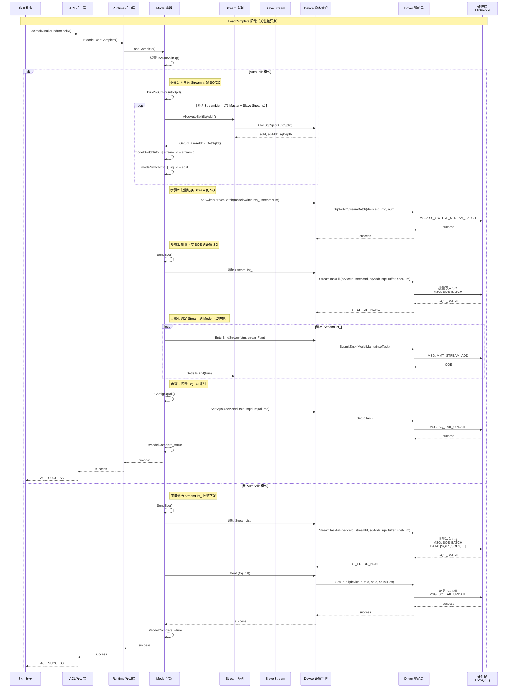

**差异说明**：
| 对比项 | AutoSplit 模式 | 非 AutoSplit 模式 |
|--------|----------------|-------------------|
| SQ/CQ 分配 | LoadComplete 时动态分配 | Stream 创建时已分配 |
| Stream 切换 | SqSwitchStreamBatch 批量切换 | 不需要切换 |
| 硬件绑定 | LoadComplete 时才建立硬件关系 | 绑定时已建立 |
| Slave Stream | 需处理所有 Master + Slave | 仅处理绑定的 Stream |

#### 3.4.5 模型执行阶段

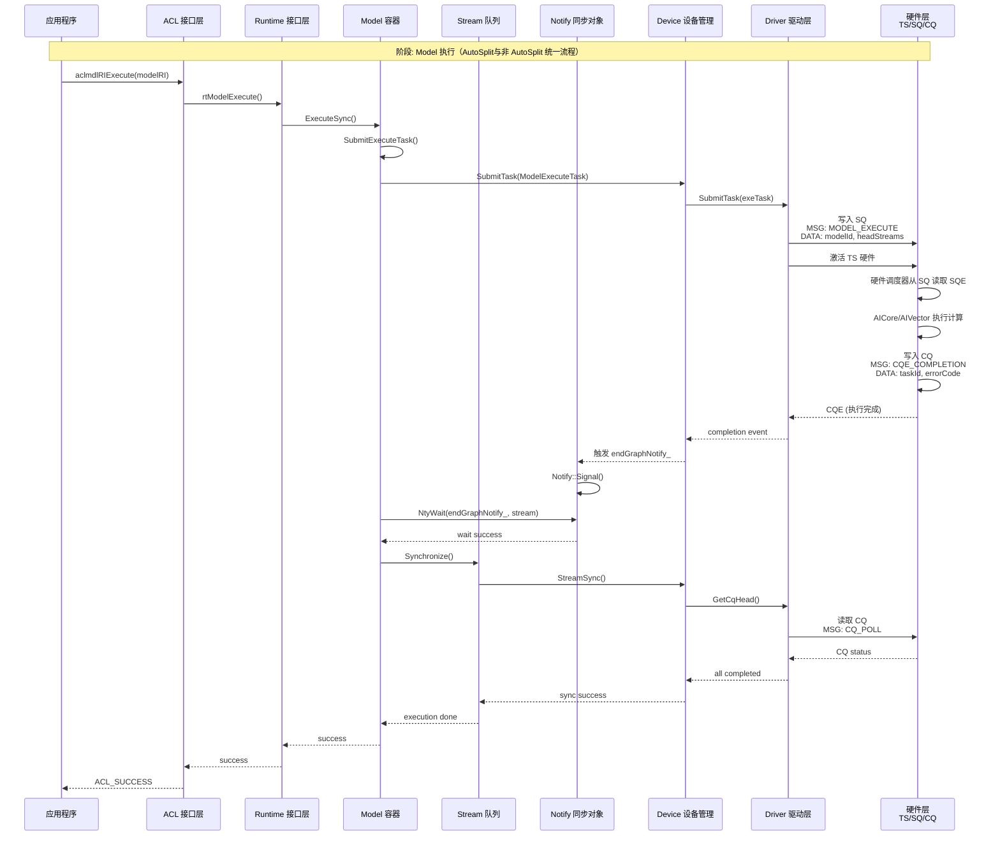

**说明**：模型执行阶段，AutoSplit 与非 AutoSplit 流程统一。差异在于 SQE 来源：
- AutoSplit：SQE 已在 LoadComplete 时从 Host Buffer 批量下发到设备 SQ
- 非 AutoSplit：SQE 在任务提交时已直接写入设备 SQ

#### 3.4.6 模型销毁阶段

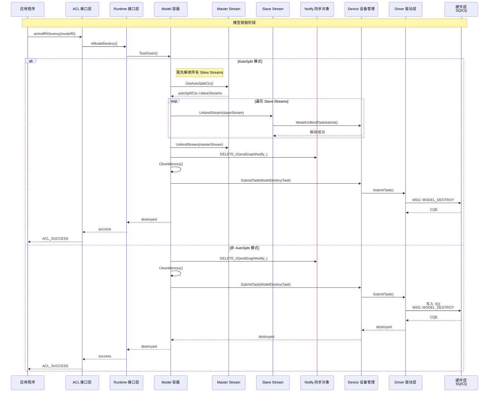

## 4. 详细设计

### 4.1 核心流程

#### 模型创建与初始化流程

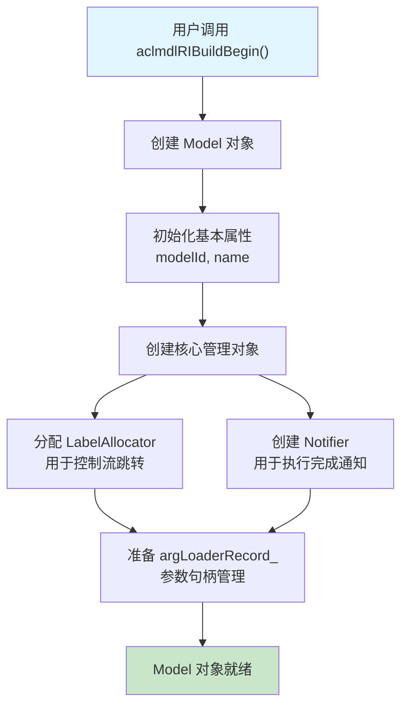

**流程说明**：
1. 用户通过 ACL 接口发起模型创建请求
2. Runtime 创建 Model 对象，分配唯一的 modelId
3. 初始化 Label 分配器，支持后续的分支跳转控制
4. 创建 Notifier 对象，用于模型执行完成后的通知机制
5. 申请设备侧内存，用于存储模型元数据
6. 准备参数句柄记录表，管理任务的参数内存

#### Stream 绑定流程

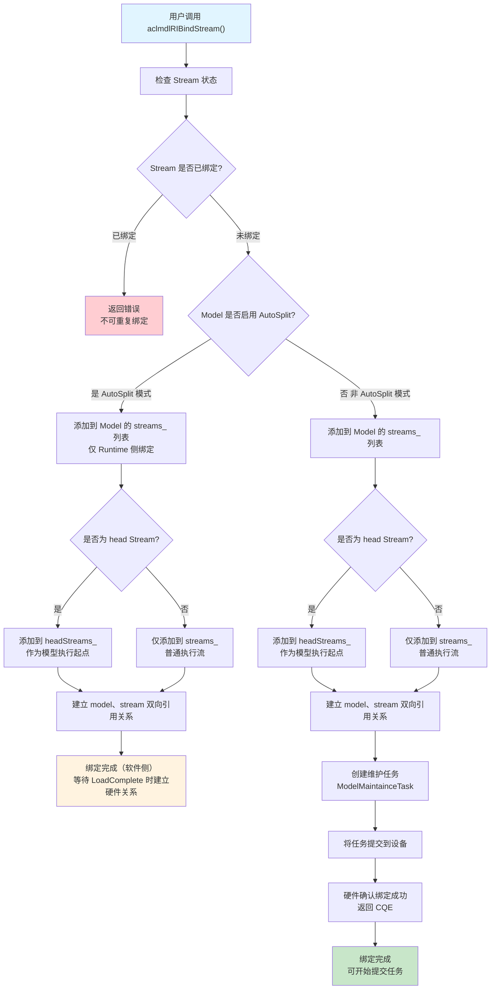

**流程说明**：

| 步骤 | AutoSplit 模式 | 非 AutoSplit 模式 |
|------|----------------|-------------------|
| 1 | 用户请求将 Stream 绑定到 Model | 用户请求将 Stream 绑定到 Model |
| 2 | 检查 Stream 状态，防止重复绑定 | 检查 Stream 状态，防止重复绑定 |
| 3 | 仅在 Runtime侧添加到 streams_列表 | 添加到 streams_列表 |
| 4 | 判断是否为 head Stream | 判断是否为 head Stream |
| 5 | 建立双向引用关系 | 建立双向引用关系 |
| 6 | **不立即提交硬件任务** | 创建维护任务，通知硬件 |
| 7 | **等待 LoadComplete** | 提交任务到设备，硬件返回 CQE |
| 8 | 绑定完成（软件侧） | 绑定完成，可开始提交任务 |

**关键差异**：AutoSplit模式下，Stream 绑定仅完成软件侧的记录，硬件绑定延迟到 LoadComplete 阶段执行，这样可以实现更灵活的任务队列管理。

#### 任务提交流程

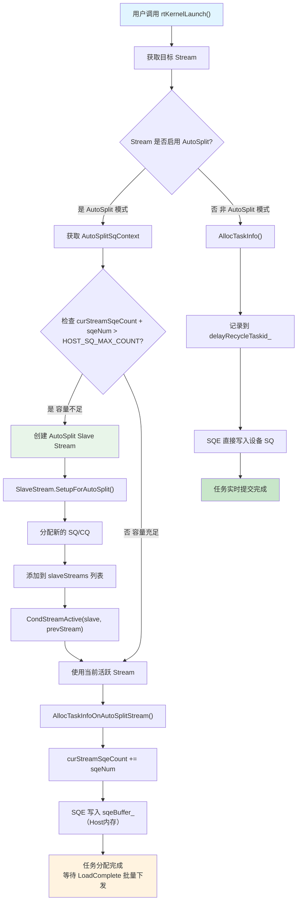

**流程说明**：

| 对比项 | AutoSplit 模式 | 非 AutoSplit 模式 |
|--------|----------------|-------------------|
| 容量检查 | 检查 curStreamSqeCount 是否接近32K | 无容量限制检查 |
| Slave创建 | 自动创建 Slave Stream 扩展容量 | 不支持 |
| SQE存储 | 写入 Host sqeBuffer_ | 直接写入设备 SQ |
| 提交时机 | LoadComplete 时批量下发 | 实时提交 |

**关键机制**：
- `HOST_SQ_MAX_COUNT = 32K`：Host SQE buffer 最大容量
- `AutoSplitSqContext`：维护 curStreamSqeCount 和 slaveStreams 列表
- `Slave Stream`：当任务数量接近32K时自动创建，实现无限队列深度

#### EndGraph 标记流程

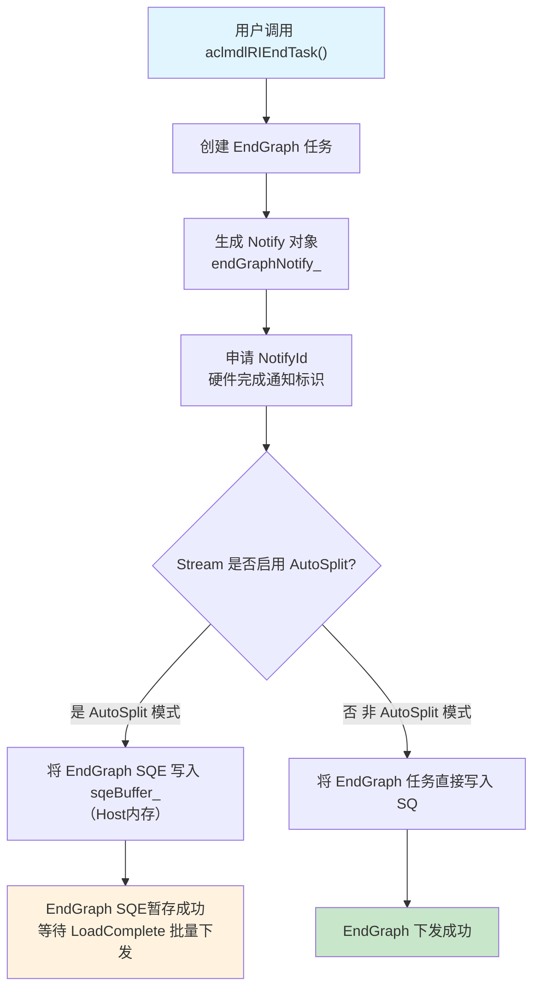

**流程说明**：

| 步骤 | AutoSplit 模式 | 非 AutoSplit 模式 |
|------|----------------|-------------------|
| 1 | 用户标记任务下发结束 | 用户标记任务下发结束 |
| 2 | 创建 EndGraph 任务 | 创建 EndGraph 任务 |
| 3 | 创建 Notify 对象，申请 NotifyId | 创建 Notify 对象，申请 NotifyId |
| 4 | **SQE 写入 Host Buffer** | EndGraph 任务写入 SQ |
| 5 | **等待 LoadComplete 批量下发** | 立即下发成功 |
| 6 | 硬件执行时触发 Notify Signal | 硬件执行时触发 Notify Signal |

#### Model LoadComplete 流程

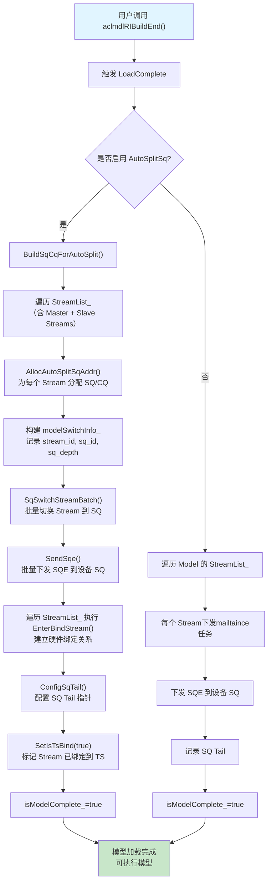

**流程说明**：

| 步骤 | AutoSplit 模式 | 非 AutoSplit 模式 |
|------|----------------|-------------------|
| 1 | BuildSqCqForAutoSplit() | 直接遍历 StreamList_ |
| 2 | 为所有 Stream（含 Slave）分配 SQ/CQ | SQ/CQ 已在创建时分配 |
| 3 | 构建 modelSwitchInfo_ | 不需要 |
| 4 | SqSwitchStreamBatch 批量切换 | 不需要 |
| 5 | SendSqe 批量下发 SQE | 下发 SQE |
| 6 | **EnterBindStream 建立硬件绑定** | **已建立硬件绑定** |
| 7 | SQ Tail |配置 SQ Tail |
| 8 | SetIsTsBind(true) | 不需要 |
| 9 | isModelComplete_=true | isModelComplete_=true |

**关键差异**：AutoSplit 模式在 LoadComplete 时需要：
1. 动态分配 SQ/CQ 资源
2. 批量切换 Stream 到 SQ
3. 建立硬件绑定关系（EnterBindStream）
4. 标记 Stream 已绑定到 TS（SetIsTsBind）

#### 模型执行流程

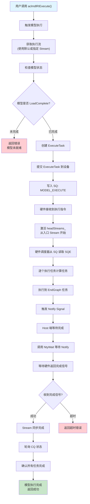

**流程说明**：

| 步骤 | 说明 | AutoSplit 与非 AutoSplit 差异 |
|------|------|------------------------------|
| 1 | 用户调用 Execute，触发模型执行 | 无差异 |
| 2 | 准备执行环境，获取执行 Stream | 无差异 |
| 3 | 检查模型状态，确保 LoadComplete 已完成 | 无差异 |
| 4 | 创建 ExecuteTask，设置执行参数 | 无差异 |
| 5 | 提交 ExecuteTask 到设备，写入 SQ | 无差异 |
| 6 | 硬件 TS 接收执行指令，激活 headStreams_ | 无差异 |
| 7 | **TS 从 SQ 读取 SQE** | **SQE来源差异** |
| 8 | AICore/AIVector 执行计算任务 | 无差异 |
| 9 | 执行到 EndGraph 任务，触发 Notify Signal | 无差异 |
| 10 | Host 端等待完成（NtyWait） | 无差异 |
| 11 | 收到完成信号后，轮询 CQ 状态 | 无差异 |
| 12 | 确认所有任务完成，返回成功 | 无差异 |

**SQE来源差异说明**：
- **AutoSplit 模式**：SQE 已在 LoadComplete 阶段从 Host sqeBuffer_ 批量下发到设备 SQ
  - 任务提交时写入 Host Buffer（延迟提交）
  - LoadComplete 时一次性批量下发所有 SQE
  - 支持无限队列深度（Slave Stream 扩展）
  
- **非 AutoSplit 模式**：SQE 在任务提交时已直接写入设备 SQ
  - 任务提交时直接写入设备 SQ（实时提交）
  - EndGraph 标记时立即下发
  - 固定队列深度

**执行阶段统一**：无论哪种模式，执行时 SQE 已全部驻留在设备 SQ，硬件 TS 直接从 SQ 读取并执行，流程完全一致。

#### Label 控制流设置流程

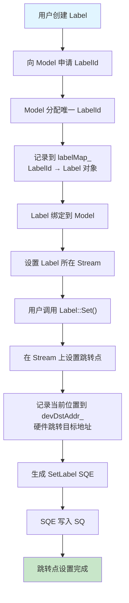

**流程说明**：
1. 用户创建 Label，向 Model 申请唯一的 LabelId
2. Model 通过 LabelAllocator 分配 ID，记录映射关系
3. Label 绑定到 Model 和 Stream
4. 用户调用 Label::Set，在 Stream 上设置跳转目标点
5. 记录当前位置到设备侧地址（devDstAddr_）
6. 生成 SetLabel SQE，写入 Stream 缓存
7. 跳转点设置完成，等待后续跳转

#### Label 控制流跳转流程

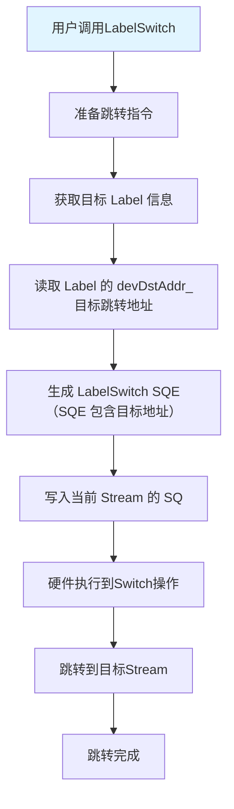

**流程说明**：
1. 用户调用 LabelSwitch接口，发起跳转指令
2. 获取目标 Label 的设备侧地址（devDstAddr_）
3. 生成 LabelSwitch SQE，包含目标跳转地址
4. 写入当前 Stream 的 SQ
5. 硬件 TS 执行到 Switch操作 ，跳转到目标位置

#### 模型销毁流程

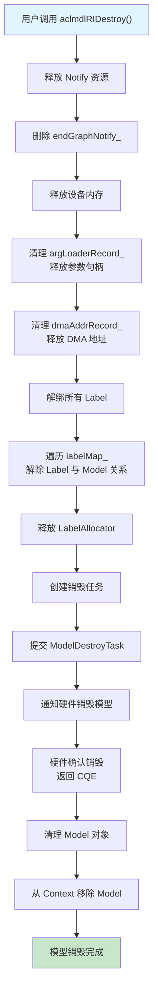

**流程说明**：
1. 用户调用 Destroy，触发模型销毁
2. 释放 Notify 资源，删除 endGraphNotify_
3. 释放设备内存，清理参数句柄记录
4. 释放 DMA 地址记录
5. 解绑所有 Label，解除与 Model 的关系
6. 释放 LabelAllocator 资源
7. 创建销毁任务，通知硬件销毁模型
8. 硬件确认销毁，返回 CQE
9. 清理 Model 对象，从 Context 移除
10. 模型销毁完成，释放所有资源

### 4.2 核心机制详解

#### Model 容器管理机制

**设计思想**：Model 作为计算图的容器，统一管理所有绑定的 Stream 和 Label，实现任务批量下发和执行入口控制。

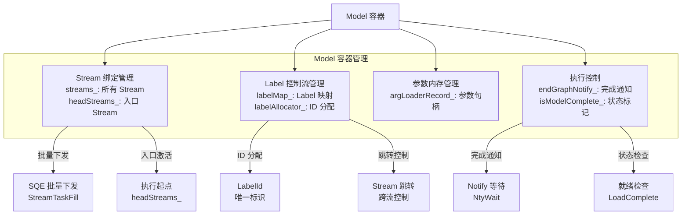

**机制说明**：
- **Stream 绑定管理**：维护所有 Stream 列表，headStreams_ 作为执行起点
- **Label 控制流管理**：分配 Label ID，管理跳转关系
- **参数内存管理**：记录任务参数句柄，避免重复分配
- **执行控制**：Notify 机制实现异步等待，状态标记确保执行顺序

#### Stream 任务队列机制

**设计思想**：Stream 作为任务队列，缓存 SQE，支持任务回收和自动 SQ 切分。

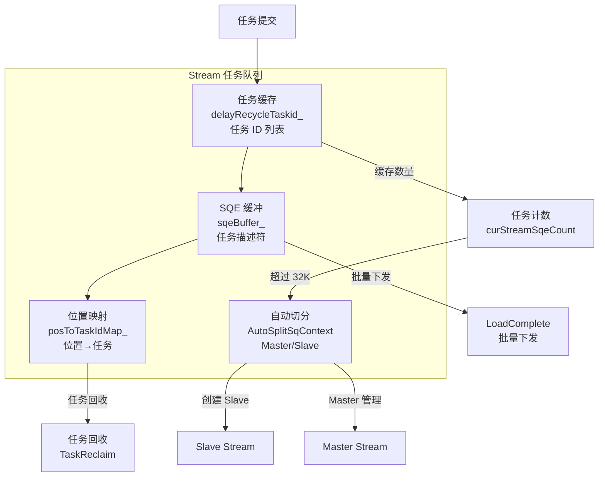

**机制说明**：
- **任务缓存**：delayRecycleTaskid_ 记录任务 ID，等待批量下发
- **SQE 缓冲**：sqeBuffer_ 存储任务描述符，准备写入硬件 SQ
- **位置映射**：posToTaskIdMap_ 记录 SQE 位置与任务的对应关系
- **自动切分**：超过 32K 任务时自动创建 Slave Stream 扩展容量

#### Label 控制流跳转机制

**设计思想**：Label 实现跨 Stream 跳转和循环控制，通过设备侧地址实现硬件级跳转。

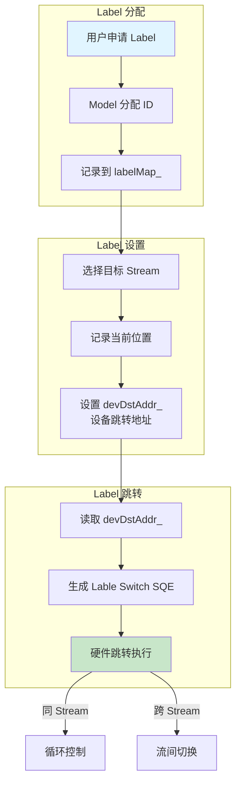

**机制说明**：
- **Label 分配**：Model 通过 LabelAllocator 分配唯一 ID
- **Label 设置**：在目标 Stream 上记录跳转位置，设置设备侧地址
- **Label 跳转**：读取设备地址，生成跳转 SQE，硬件执行跳转
- **控制流实现**：支持循环（同 Stream）和跨 Stream 任务切换

#### Notify 完成通知机制

**设计思想**：Notify 实现硬件完成通知，Host 通过等待 Notify 获取执行结果。

```mermaid
sequenceDiagram
    participant Model as Model
    participant EndGraph as EndGraphTask
    participant Notify as endGraphNotify_
    participant Driver as Driver
    participant HW as 硬件 TS
    
    %% EndGraph 创建 Notify
    Model->>EndGraph: rtEndGraph(model, stream)
    EndGraph->>Notify: 创建 Notify 对象
    Notify->>Driver: AllocNotifyId()
    Driver->>HW: 申请 notifyId
    HW-->>Driver: notifyId
    Driver-->>Notify: notifyId
    Notify-->>Model: endGraphNotify_
    
    %% 执行时写入 EndGraph Task
    Model->>EndGraph: Execute()
    EndGraph->>Driver: SubmitTask(EndGraphTask)
    Driver->>HW: SQE: END_GRAPH<br/>notifyId=notifyId_
    HW->>HW: 执行所有前置任务
    HW->>HW: 执行 EndGraph Task
    HW->>HW: Signal Notify<br/>notifyId ← value++
    
    %% Host 等待 Notify
    Model->>Notify: NtyWait(endGraphNotify_, stream)
    Notify->>Driver: Notify::Wait()
    Driver->>HW: Poll Notify Value<br/>MSG: NOTIFY_POLL
    HW-->>Driver: notifyValue
    Driver-->>Notify: value matched
    Notify-->>Model: wait success
    Model->>Model: 执行完成
```

**机制说明**：
- **Notify 创建**：EndGraph 任务申请 NotifyId，绑定到 Model
- **Notify 等待**：Host 通过 NtyWait 轮询 Notify Value
- **Notify 触发**：硬件执行到 EndGraph，Signal Notify，更新 Value
- **完成确认**：Host 检测到 Value 匹配，确认执行完成

### 4.3 模块职责划分

Model 模块按照功能划分为核心容器、任务管理、接口层、辅助工具等子模块，各模块职责清晰，协同完成模型全生命周期管理。

#### 核心容器模块

| 模块名称 | 核心职责 | 代码位置 | 主要功能 |
|----------|----------|----------|----------|
| **Model 核心类** | 计算图容器，统一管理 Stream/Label/Notify | `src/runtime/core/inc/model/model.hpp`<br/>`src/runtime/feature/model/model.cc` | • 绑定/解绑 Stream<br/>• 分配/释放 Label<br/>• 执行同步/异步模型<br/>• 批量下发 SQE<br/>• 管理 argLoaderRecord |
| **Model C 接口** | 对外 C 风格 API 封装 | `src/runtime/api/api_c_model.cc` | • rtModelCreate<br/>• rtModelDestroy<br/>• rtModelBindStream<br/>• rtModelExecute<br/>• rtEndGraph<br/>• rtModelLoadComplete |

#### 任务管理模块

| 任务类型 | 任务职责 | 代码位置 | 触发时机 |
|----------|----------|----------|----------|
| **ModelExecuteTask** | 触发模型执行，激活 headStreams | `src/runtime/core/src/task/task_info/model/model_execute_task.cc`<br/>`src/runtime/core/src/task/task_info/model/model_execute_task_v100.cc`<br/>`src/runtime/core/src/task/task_info/model/model_execute_task_v200_base.cc` | Execute/ExecuteAsync 调用时 |
| **ModelMaintainceTask** | 维护 Stream 与 Model 关系 | `src/runtime/core/src/task/task_info/model/model_maintaince_task.cc`<br/>`src/runtime/core/src/task/task_info/model/model_maintaince_task_v100.cc`<br/>`src/runtime/core/src/task/task_info/model/model_maintaince_task_v200_base.cc` | BindStream/UnbindStream<br/>LoadComplete 时 |
| **ModelGraphTask** | EndGraph 标记，创建 Notify | `src/runtime/core/src/task/task_info/model/model_graph_task.cc`<br/>`src/runtime/core/src/task/task_info/model/model_graph_task_v100.cc`<br/>`src/runtime/core/src/task/task_info/model/model_graph_task_v200_base.cc` | rtEndGraph 调用时 |

#### 辅助工具模块

| 工具模块 | 辅助职责 | 代码位置 | 服务对象 |
|----------|----------|----------|----------|
| **LabelAllocator** | Label ID 分配器 | `src/runtime/core/inc/launch/label.hpp` | Model Label 管理 |
| **Notify** | 硬件完成通知对象 | `src/runtime/core/inc/notify/notify.hpp`<br/>`src/runtime/core/src/notify/notify.cc` | EndGraph Notify |

#### 接口适配层

| 适配层 | 适配职责 | 代码位置 | 服务对象 |
|----------|----------|----------|----------|
| **ACL 接口封装** | ACL → RT 接口映射 | `src/acl/aclrt_impl/model_ri.cpp` | 用户调用 aclmdlRI 接口 |
| **API 装饰器** | API 错误处理装饰 | `src/runtime/core/src/api_impl/api_decorator.cc`| ApiImpl 调用链 |


### 5 关键文件路径索引

| 模块类别 | 文件路径 | 核心内容 |
|----------|----------|----------|
| **Model 头文件** | `src/runtime/core/inc/model/model.hpp` | Model 类定义、数据结构 |
| **Model 实现** | `src/runtime/feature/model/model.cc` | Model 核心实现 |
| **Model C 接口** | `src/runtime/feature/model/model_c.cc` | C 风格接口实现 |
| **Model Execute Task** | `src/runtime/core/src/task/task_info/model/model_execute_task.cc` | 执行任务实现 |
| **Model Execute Task V100** | `src/runtime/core/src/task/task_info/model/model_execute_task_v100.cc` | V100 版本适配 |
| **Model Execute Task V200** | `src/runtime/core/src/task/task_info/model/model_execute_task_v200_base.cc` | V200 版本适配 |
| **Model Maintaince Task** | `src/runtime/core/src/task/task_info/model/model_maintaince_task.cc` | 维护任务实现 |
| **ACL 接口头文件** | `include/external/acl/acl_rt.h` | ACL 外部接口定义 |
| **ACL 接口实现** | `src/acl/aclrt_impl/model_ri.cpp` | ACL 接口实现（aclmdlRI 系列） |
