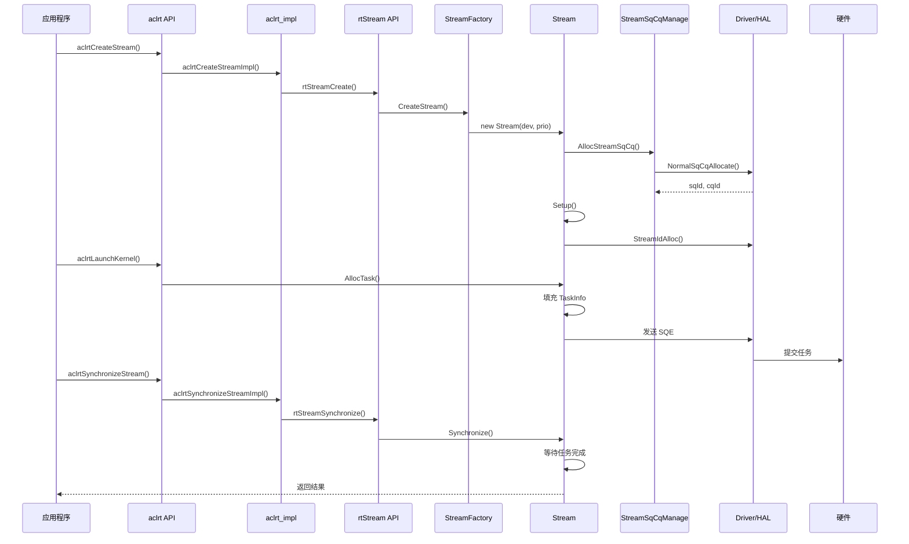
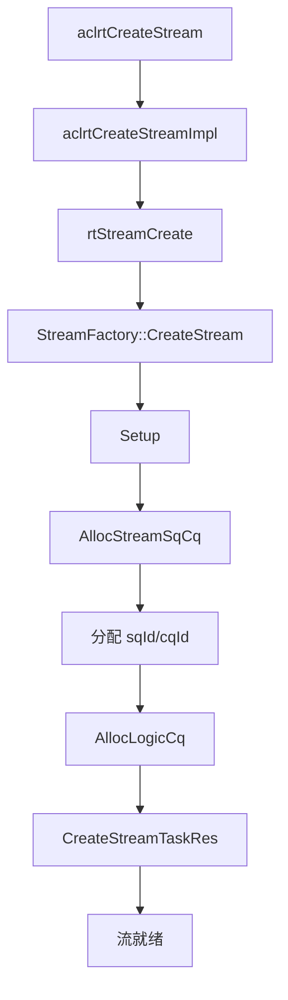
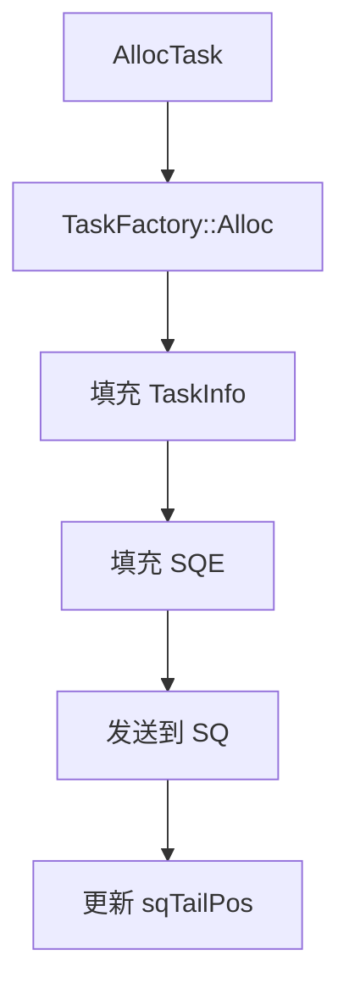
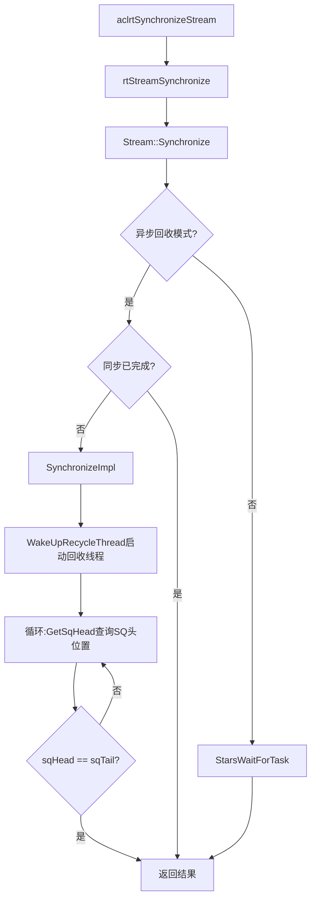
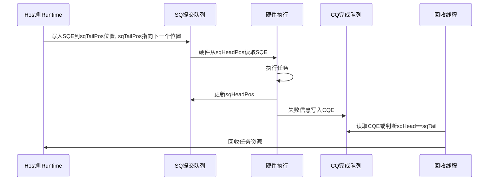
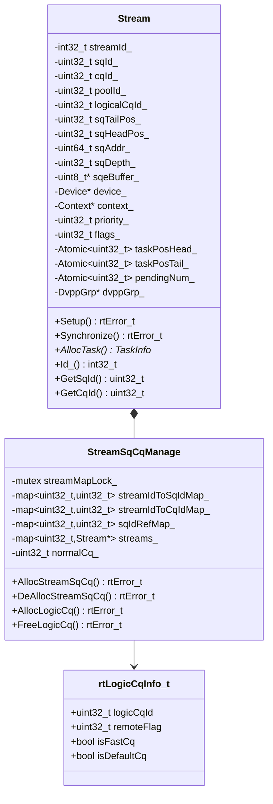

# Stream 模块架构

## 1. 模块概述

- **功能介绍**：Stream 模块负责管理任务队列，实现异步执行和同步机制。通过 SQ（Submission Queue）和 CQ（Completion Queue）机制与硬件交互。
- **设计目标**：
  - 提供高效的异步任务执行机制
  - 实现任务队列管理和同步机制
  - 支持 SQ/CQ 资源管理和复用

## 2. 使用场景与对外接口

### 2.1 使用场景

- **场景一**：创建流并提交任务
  ```cpp
  aclrtStream stream;
  aclrtCreateStream(&stream);  // 创建流
  aclrtLaunchKernel(stream, ...);  // 提交内核任务
  aclrtSynchronizeStream(stream);  // 等待完成
  ```

- **场景二**：多流并行执行
  ```cpp
  aclrtStream stream1, stream2;
  aclrtCreateStream(&stream1);
  aclrtCreateStream(&stream2);
  // 在不同流上并行执行任务
  aclrtLaunchKernel(stream1, kernel1, ...);
  aclrtLaunchKernel(stream2, kernel2, ...);
  ```

- **场景三**：带配置创建流
  ```cpp
  aclrtStream stream;
  aclrtCreateStreamWithConfig(&stream, 0, ACL_STREAM_FAST_SYNC);  // 创建快速同步流
  ```

### 2.2 对外接口

#### 核心接口

| 接口 | 说明 |
|------|------|
| `aclrtCreateStream()` | 创建流 |
| `aclrtCreateStreamWithConfig()` | 带优先级和标志创建流 |
| `aclrtDestroyStream()` | 销毁流 |
| `aclrtDestroyStreamForce()` | 强制销毁流 |
| `aclrtSynchronizeStream()` | 同步流 |
| `aclrtStreamQuery()` | 查询流状态 |

#### 扩展接口

| 接口 | 说明 |
|------|------|
| `aclrtSynchronizeStreamWithTimeout()` | 带超时同步流 |
| `aclrtStreamGetPriority()` | 获取流优先级 |
| `aclrtStreamGetFlags()` | 获取流标志 |
| `aclrtStreamAbort()` | 终止流执行 |
| `aclrtStreamGetId()` | 获取流 ID |
| `aclrtGetStreamAvailableNum()` | 获取可用流数量 |

#### 流属性接口

| 接口 | 说明 |
|------|------|
| `aclrtSetStreamAttribute()` | 设置流属性 |
| `aclrtGetStreamAttribute()` | 获取流属性 |
| `aclrtSetStreamFailureMode()` | 设置流失败模式 |
| `aclrtSetStreamOverflowSwitch()` | 设置流溢出开关 |
| `aclrtGetStreamOverflowSwitch()` | 获取流溢出开关 |

#### 流控制接口

| 接口 | 说明 |
|------|------|
| `aclrtActiveStream()` | 激活流 |
| `aclrtSwitchStream()` | 切换流 |
| `aclrtStreamStop()` | 停止流 |
| `aclrtPersistentTaskClean()` | 清理持久任务 |

#### 流配置接口

| 接口 | 说明 |
|------|------|
| `aclrtCreateStreamConfigHandle()` | 创建流配置句柄 |
| `aclrtDestroyStreamConfigHandle()` | 销毁流配置句柄 |
| `aclrtSetStreamConfigOpt()` | 设置流配置选项 |
| `aclrtCreateStreamV2()` | 带配置创建流 |

## 3. 架构总览

### 整体设计思路

Stream 采用 SQ/CQ 异步机制实现任务执行：任务通过 SQ 提交到硬件，硬件执行完成后通过 CQ 返回结果。Stream 维护任务队列（taskPosHead/taskPosTail），支持任务分配、回收和同步。继承自 NoCopy 基类防止拷贝。

### 核心模块交互图



## 4. 详细设计

### 4.1 核心流程

#### 流创建流程



**关键代码**：

```cpp
// 文件位置：src/acl/aclrt_impl/stream.cpp:33-50
aclError aclrtCreateStreamImpl(aclrtStream *stream) {
    rtStream_t rtStream = nullptr;
    const rtError_t rtErr = rtStreamCreate(&rtStream, 
        static_cast<int32_t>(RT_STREAM_PRIORITY_DEFAULT));
    if (rtErr != RT_ERROR_NONE) {
        return ACL_GET_ERRCODE_RTS(rtErr);
    }
    *stream = static_cast<aclrtStream>(rtStream);
    return ACL_SUCCESS;
}

// 文件位置：src/runtime/core/src/stream/stream.cc:606-788
rtError_t Stream::Setup() {
    // 设置 SQ 深度
    const uint32_t rtsqDepth = 
        (((flags_ & RT_STREAM_HUGE) != 0U) && 
         (device_->GetDevProperties().maxTaskNumPerHugeStream != 0)) ?
            device_->GetDevProperties().maxTaskNumPerHugeStream :
            device_->GetDevProperties().rtsqDepth;
    SetSqDepth(rtsqDepth);

    // 分配 streamId
    error = device_->Driver_()->StreamIdAlloc(&streamId_, device_->Id_(), 
                                               device_->DevGetTsId(), priority_);
    
    // 分配 SQ/CQ
    error = stmSqCqManage->AllocStreamSqCq(this, priority_, 0U, tmpSqId, tmpCqId);
    sqId_ = tmpSqId;
    cqId_ = tmpCqId;

    // 分配逻辑 CQ
    error = AllocLogicCq(isDisableThread, starsFlag, stmSqCqManage);
    
    // 创建任务资源
    CreateStreamTaskRes();
    error = CreateStreamArgRes();
    
    return RT_ERROR_NONE;
}
```

#### 任务提交流程



**关键代码**：

```cpp
// 1. 任务分配
// 文件位置：src/runtime/core/src/stream/stream.cc:4544-4579
TaskInfo* Stream::AllocTask(TaskInfo* pTask, tsTaskType_t taskType,
                            rtError_t& errorReason, uint32_t sqeNum,
                            UpdateTaskFlag flag) {
    // 正常分配
    if (taskResMang_ == nullptr) {
        return device_->GetTaskFactory()->Alloc(this, taskType, errorReason);
    } else {
        pTask->stream = this;
        return pTask;
    }
}

// 2. 填充 TaskInfo（以 AICore 任务为例）
// 文件位置：src/runtime/core/src/task/task_info.hpp
TaskInfo* taskInfo = stream->AllocTask(nullptr, TS_TASK_TYPE_KERNEL_AICORE, error);
taskInfo->type = TS_TASK_TYPE_KERNEL_AICORE;
taskInfo->typeName = "AICoreKernel";
taskInfo->stream = stream;
taskInfo->sqeNum = 1;
// 填充 AICore 内核参数
taskInfo->u.aicoreKernel.kernel = kernel;         // 内核对象
taskInfo->u.aicoreKernel.args = args;             // 参数地址
taskInfo->u.aicoreKernel.blockDim = blockDim;     // 块维度
taskInfo->u.aicoreKernel.smDesc = smDesc;         // 共享内存描述

// 3. 填充 SQE
// 文件位置：src/runtime/core/src/task/task_submit/v200/task_david.cc:497-589
rtError_t DavidSendTask(TaskInfo *taskInfo, Stream *stm) {
    const uint16_t pos = taskInfo->id;
    uint64_t sqBaseAddr = stm->GetSqBaseAddr();
    
    // 确定 SQE 写入目标
    rtDavidSqe_t *sqeAddr = nullptr;
    if (sqBaseAddr != 0ULL) {
        // 硬件 SQ 模式：直接写到设备 SQ 内存
        sqeAddr = RtPtrToPtr<rtDavidSqe_t*>(sqBaseAddr + (pos << SHIFT_SIX_SIZE));
    }
    
    // 构建 SQE 内容
    ToConstructDavidSqe(taskInfo, sqeAddr, sqBaseAddr);
    // 填充 SQE 字段（AICore 任务）
    sqeAddr->taskType = TS_TASK_TYPE_KERNEL_AICORE;
    sqeAddr->taskId = taskInfo->id;
    sqeAddr->sqId = stm->GetSqId();
    sqeAddr->cqId = stm->GetCqId();
    sqeAddr->kernelAddr = kernel->GetAddr();
    sqeAddr->argsAddr = args;
    // ... 其他 SQE 字段
}

// 4. 发送到 SQ
// 文件位置：src/runtime/core/src/task/task_submit/v200/task_david.cc
struct halTaskSendInfo sendInfo = {0};
sendInfo.sqId = stm->GetSqId();
sendInfo.cqId = stm->GetCqId();
sendInfo.sqeAddr = sqeAddr;
sendInfo.sqeNum = taskInfo->sqeNum;

drvError_t drvRet = halSqTaskSend(devId, &sendInfo);  // DRV 层提交到硬件 SQ
if (drvRet != DRV_ERROR_NONE) {
    return RT_ERROR_DRV_INNER_ERROR;
}

// 更新 SQ tail 位置
stm->UpdateSqTailPos(taskInfo->sqeNum);
```

#### 流同步流程



**关键代码**：

```cpp
// 文件位置：src/runtime/core/src/stream/stream.cc:1868-1913
rtError_t Stream::SynchronizeExecutedTask(const uint32_t taskId, const mmTimespec &beginTime, int32_t timeout) {
    uint16_t sqHead = static_cast<uint16_t>(MAX_UINT16_NUM);
    while (true) {
        // 检查任务是否已执行完成
        if (sqHead == GetTaskPosTail()) {
            return RT_ERROR_NONE;
        }
        // 启动回收线程（仅调用一次）
        if (!device_->GetIsDoingRecycling()) {
            device_->WakeUpRecycleThread();
        }
        // 获取 SQ 头位置，循环等待
        error = device_->Driver_()->GetSqHead(Device_()->Id_(), Device_()->DevGetTsId(), sqId_, sqHead);
        if (IsTaskExcuted(finishedId, taskId)) {
            return RT_ERROR_NONE;
        }
    }
}

// 文件位置：src/runtime/core/src/stream/stream.cc:1941-1959
rtError_t Stream::SynchronizeImpl(const uint32_t syncTaskId, const uint16_t concernedTaskId, int32_t timeout) {
    const mmTimespec beginTime = mmGetTickCount();
    error = SynchronizeExecutedTask(syncTaskId, beginTime, timeout);  // 循环等待任务执行完成
    StreamSyncFinishReport();
    if (concernedTaskId == MAX_UINT16_NUM) {
        device_->WakeUpRecycleThread();  // 唤醒回收线程处理后续回收
        return error;
    }
    error = WaitConcernedTaskRecycled(concernedTaskId, beginTime, timeout);
    return error;
}
```

### 4.2 核心机制详解

#### SQ/CQ 异步机制

**设计思想**：通过 SQ（提交队列）和 CQ（完成队列）实现异步任务执行。任务以 SQE（Submission Queue Entry）形式提交到 SQ，硬件执行完成后通过 CQE（Completion Queue Entry）返回结果（一般情况下，任务失败才返回CQE，正常任务不返回CQE）。

**任务执行流程**：



**关键要点**：

- **任务提交**：Host 将 SQE 写入 sqTail 位置，sqTailPos 指向下一个可用位置
- **硬件执行**：硬件从 sqHeadPos 位置读取 SQE，执行任务后更新 sqHeadPos
- **完成判断**：回收线程读取 CQE 获取结果，或判断 sqHead == sqTail 确认任务执行完成

```cpp
// 文件位置：src/runtime/core/src/stream/stream.hpp
class Stream : public NoCopy {
protected:
    uint32_t sqId_;                     // SQ ID
    uint32_t cqId_;                     // CQ ID
    uint32_t sqTailPos_;                // SQ 尾位置（Host提交位置）
    uint32_t sqHeadPos_;                // SQ 头位置（硬件处理位置）
    uint64_t sqRegVirtualAddr_;         // SQ 寄存器虚拟地址
private:
    uint64_t sqAddr_;                   // SQ 基地址 (最大 2M)
    uint32_t sqDepth_;                  // SQ 深度
    uint8_t* sqeBuffer_;                // SQE 缓冲区指针
    Atomic<uint32_t> taskPosHead_;      // 任务位置头 (Stars)
    Atomic<uint32_t> taskPosTail_;      // 任务位置尾 (Stars)
};
```

### 4.3 模块职责划分

| 模块 | 职责 | 位置 |
|------|------|------|
| aclrt API | 对外 ACL 接口 | `include/external/acl/acl_rt.h` |
| aclrt_impl | ACL 接口实现 | `src/acl/aclrt_impl/stream.cpp` |
| rt API | 内部 RT 接口 | `src/runtime/api/api_c_stream.cc` |
| Stream | 流管理核心类，继承自 NoCopy | `stream/stream.hpp` |
| StreamFactory | 静态流创建工厂，版本分发 | `stream/stream_factory.hpp` |
| StreamSqCqManage | SQ/CQ ID 管理与复用 | `stream/stream_sqcq_manage.hpp` |
| TaskAllocator | 任务对象分配器 | `task/task_allocator.hpp` |
| TaskResManage | 任务资源管理 | `task/task_res_manage/` |
| EngineStreamObserver | 流状态观察者 | `stream/engine_stream_observer.hpp` |

### 4.4 核心数据结构



## 5. 性能优化策略

- **任务预分配**：TaskAllocator 预分配任务对象，减少分配开销
- **异步回收**：支持异步任务回收，不阻塞任务提交
- **快速同步模式**：ACL_STREAM_FAST_SYNC 标志支持快速同步

_本模块文档基于源码分析，已验证所有 ACL 接口来自 `include/external/acl/acl_rt.h`，实现来自 `src/acl/aclrt_impl/stream.cpp`。_